---
## Front matter
title: "Отчёт о лабораторной работе"
subtitle: "Лабораторная работа 4"
author: "Мошаров Денис Максимович"

## Generic otions
lang: ru-RU
toc-title: "Содержание"

## Bibliography
bibliography: bib/cite.bib
csl: pandoc/csl/gost-r-7-0-5-2008-numeric.csl

## Pdf output format
toc: true # Table of contents
toc-depth: 2
lof: true # List of figures
lot: true # List of tables
fontsize: 12pt
linestretch: 1.5
papersize: a4
documentclass: scrreprt
## I18n polyglossia
polyglossia-lang:
  name: russian
  options:
	- spelling=modern
	- babelshorthands=true
polyglossia-otherlangs:
  name: english
## I18n babel
babel-lang: russian
babel-otherlangs: english
## Fonts
mainfont: IBM Plex Serif
romanfont: IBM Plex Serif
sansfont: IBM Plex Sans
monofont: IBM Plex Mono
mathfont: STIX Two Math
mainfontoptions: Ligatures=Common,Ligatures=TeX,Scale=0.94
romanfontoptions: Ligatures=Common,Ligatures=TeX,Scale=0.94
sansfontoptions: Ligatures=Common,Ligatures=TeX,Scale=MatchLowercase,Scale=0.94
monofontoptions: Scale=MatchLowercase,Scale=0.94,FakeStretch=0.9
mathfontoptions:
## Biblatex
biblatex: true
biblio-style: "gost-numeric"
biblatexoptions:
  - parentracker=true
  - backend=biber
  - hyperref=auto
  - language=auto
  - autolang=other*
  - citestyle=gost-numeric
## Pandoc-crossref LaTeX customization
figureTitle: "Рис."
tableTitle: "Таблица"
listingTitle: "Листинг"
lofTitle: "Список иллюстраций"
lotTitle: "Список таблиц"
lolTitle: "Листинги"
## Misc options
indent: true
header-includes:
  - \usepackage{indentfirst}
  - \usepackage{float} # keep figures where there are in the text
  - \floatplacement{figure}{H} # keep figures where there are in the text
---

# Цель работы

Приобретение практических навыков по установке и базовому конфигурированию HTTP-сервера Apache.

# Выполнение лабораторной работы

Для начала запустим наш сервер через vagrant (рис. [-@fig:001]).

{#fig:001}

Установим пакеты, необходимые для работы веб-сервера (рис. [-@fig:002]).

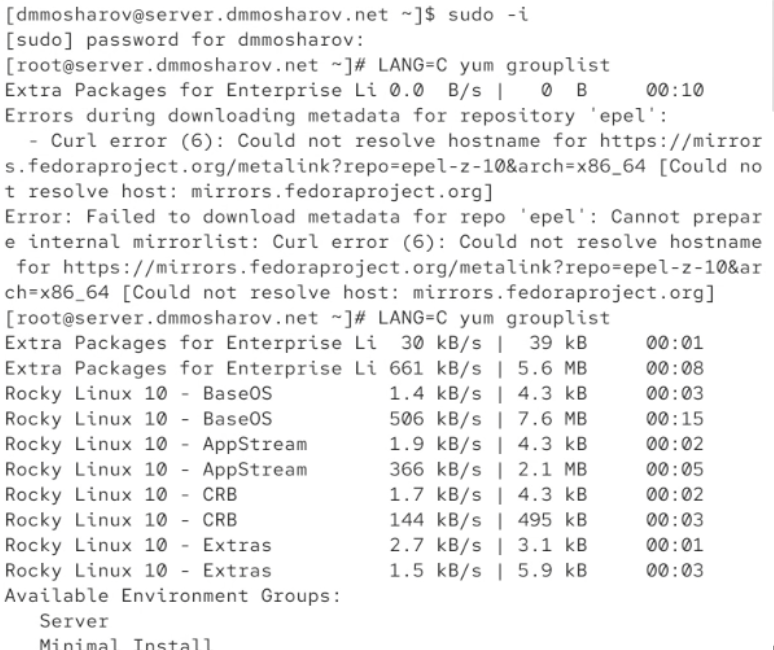{#fig:002}

Проанализируем содержимое конфигурационных файлов сервера. Начнём с файла /etc/httpd/conf/httpd.conf. В нём содержатся основные настройки веб-сервера Apache. (рис. [-@fig:003]).

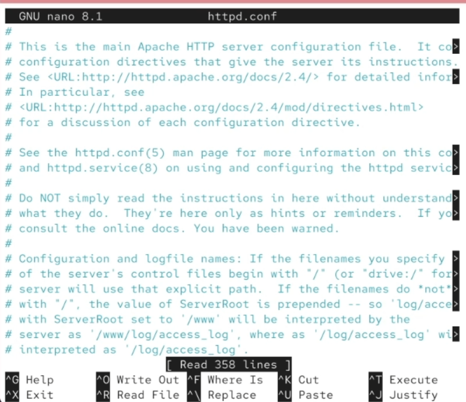{#fig:003}

В файле /etc/httpd/conf/magic содержатся инструкции для определения MIME-типа файла по его содержимому, а не расширению (рис. [-@fig:004]).

{#fig:004}

В файле /etc/httpd/conf.d/autoindex.conf содержатся настройки для автоматического отображения списка файлов в директории (рис. [-@fig:005]).

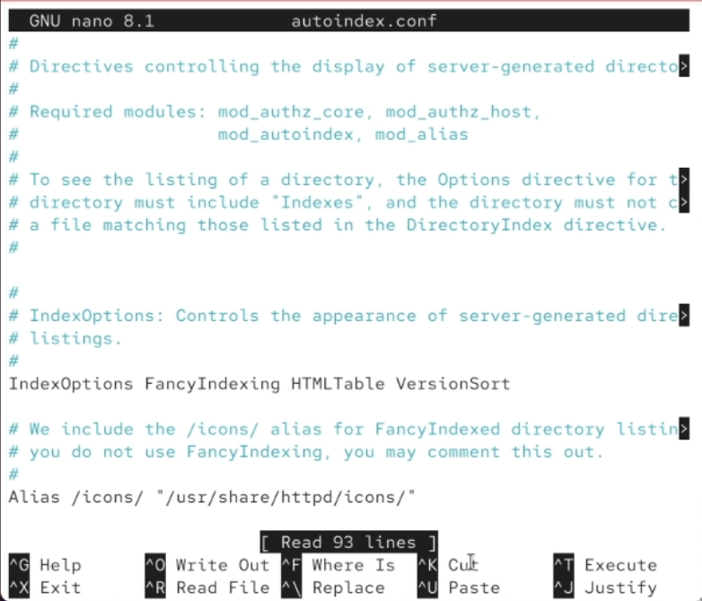{#fig:005}

В файле /etc/httpd/conf.d/manual.conf содержатся настройки для доступа к веб-странице с документацией Apache (рис. [-@fig:006]).

{#fig:006}

В файле /etc/httpd/conf.d/userdir.conf содержатся настройки для доступа к публичным веб-директориям пользователей системы (рис. [-@fig:007]).

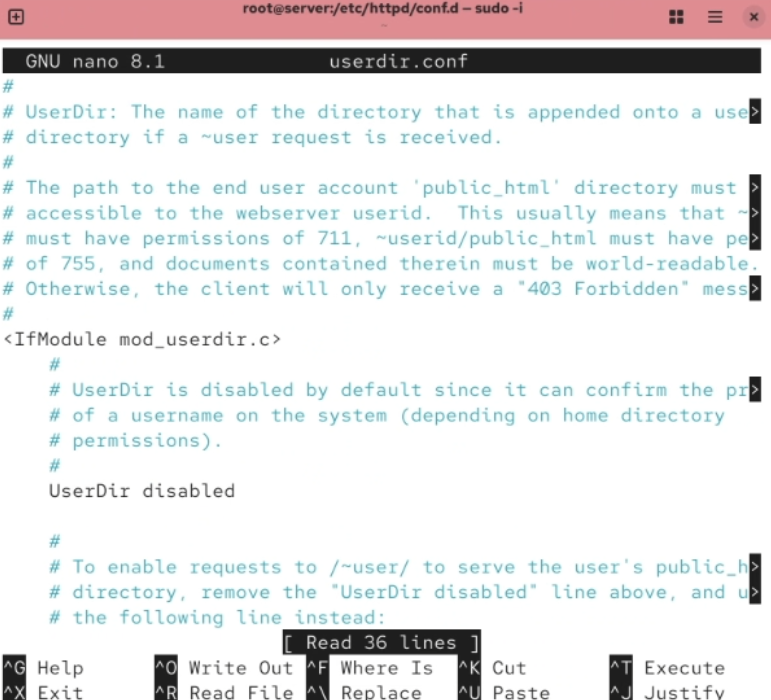{#fig:007}

В файле /etc/httpd/conf.d/fcgid.conf содержатся настройки для модуля mod_fcgid, который используется для запуска скриптов (например, PHP) через FastCGI (рис. [-@fig:008]).

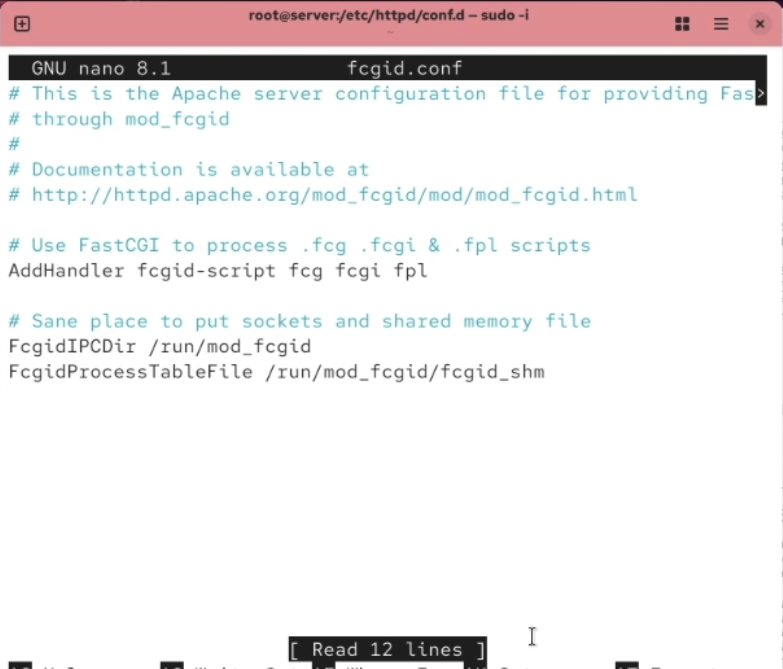{#fig:008}

В файле /etc/httpd/conf.d/ssl.conf содержатся настройки для поддержки шифрования SSL/TLS (рис. [-@fig:009]).

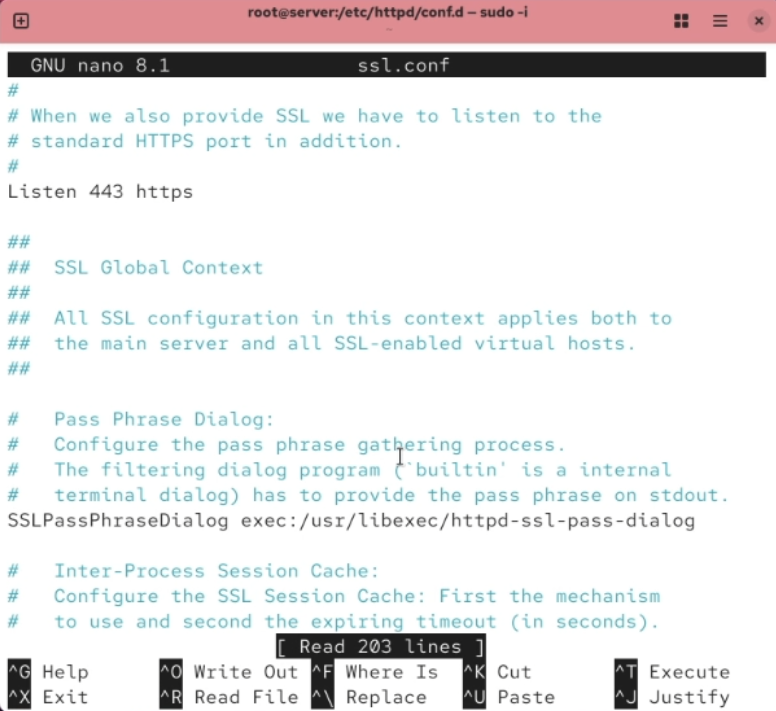{#fig:009}

В файле /etc/httpd/conf.d/welcome.conf содержатся настройки для отображения приветственной страницы по умолчанию после установки Apache (рис. [-@fig:010]).

{#fig:010}

Теперь добавим службу http в фаервол для корректной работы (рис. [-@fig:011]).

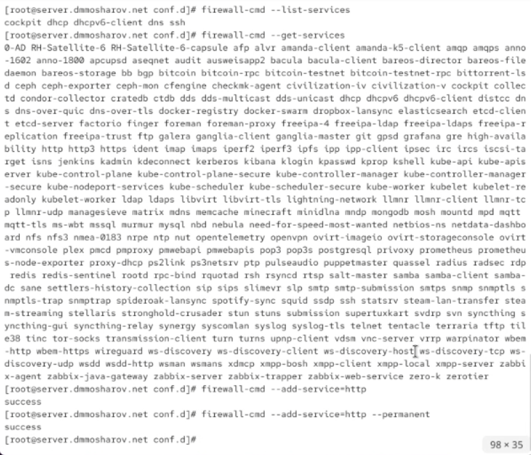{#fig:011}

Запустим в отдельной вкладке journalctl с ключом -f для вывода информации логов в реальном времени (рис. [-@fig:012]).

{#fig:012}

Теперь попробуем запустить службу httpd и включить в ней автозагрузку (рис. [-@fig:013]).

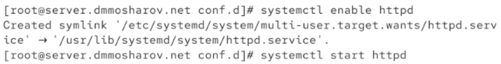{#fig:013}

Вернёмся ко вкладке с journalctl. Как видим, запуск httpd был успешен (рис. [-@fig:014]).

{#fig:014}

Теперь запустим клиент (рис. [-@fig:015]).

{#fig:015}

Зайдём в клиенте в браузер и перейдём по адресу 192.168.1.1. Как видим, это страница, которая используется вебсервером по умолчанию. Таким образом, она даёт нам понять, что Служба httpd работает корректно, и клиент может получить доступ к содержимому веб-страницы (рис. [-@fig:016]).

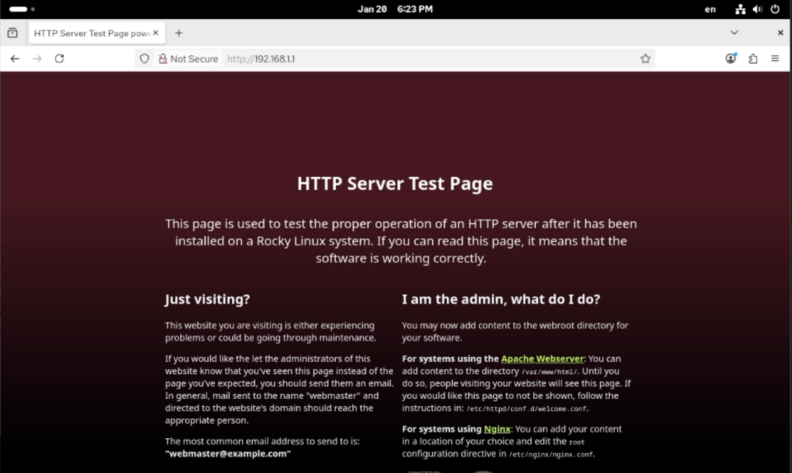{#fig:016}

Теперь выведем логи об ошибках веб-сервера в файле /var/log/httpd/error_log (рис. [-@fig:017]).

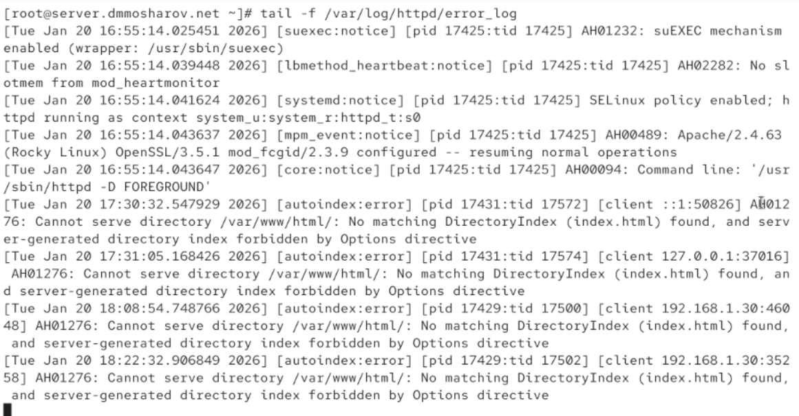{#fig:017}

И выведем лог о доступе к веб-странице в файле /var/log/httpd/access_log (рис. [-@fig:018]).

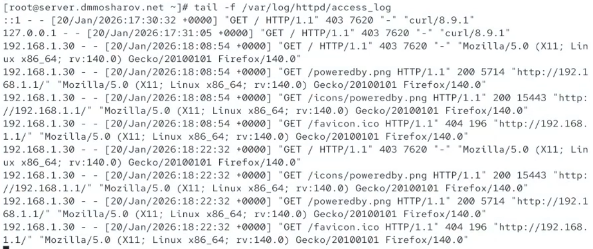{#fig:018}

Остановим службу named, отвечающую за dns (рис. [-@fig:019]).

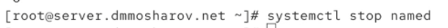{#fig:019}

Поменяем файл зоны, добавив в него запись о том, что теперь у нас есть http сервер (www) (рис. [-@fig:020]).

{#fig:020}

То же самое сделаем в обратном файле зоны (рис. [-@fig:021]).

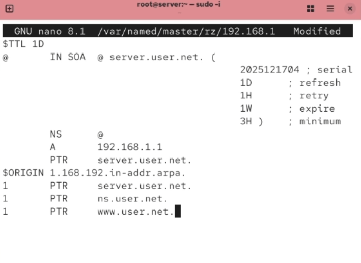{#fig:021}

Удалим файлы журналов из папок обратной и прямой зон (рис. [-@fig:022]).

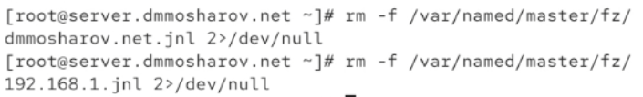{#fig:022}

Теперь запустим dns службу и перейдём в папку с конфигурацией httpd (/etc/httpd/conf.d), создав дам файлы конфигурации для двух страниц - server.dmmosharov.net и www.dmmosharov.net (рис. [-@fig:023]).

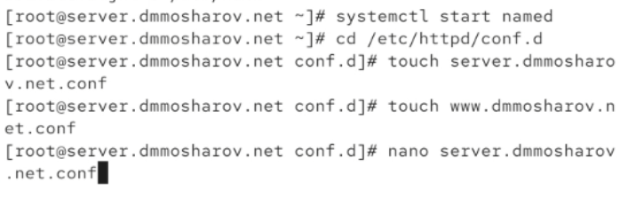{#fig:023}

Поместим следующее содержимое в первый из файлов (рис. [-@fig:024]).

{#fig:024}

И следующее содержимое во второй файл (рис. [-@fig:025]).

{#fig:025}

В папке /var/www/html создадим папки server.dmmosharov.net и www.dmmosharov.net. В каждой из них создадим файл index.html, в каждый из которых запишем простую приветственную фразу (рис. [-@fig:026]).

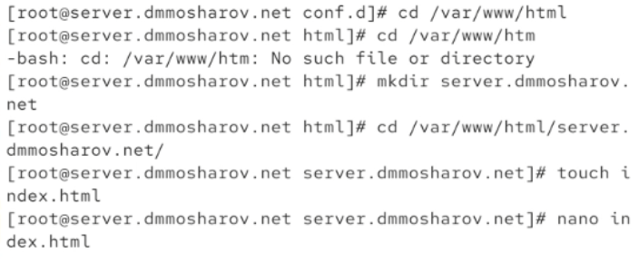{#fig:026}

Теперь обновим метки для SElinux и перезапустим службу httpd (рис. [-@fig:027]).

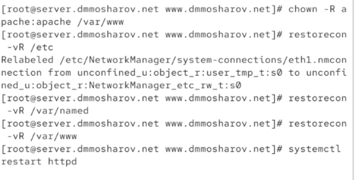{#fig:027}

Теперь с клиента попробуем перейти по адресу server.dmmosharov.net. Как видим, нам вывело страницу с той самой фразой, которую мы записывали в index.html ранее (рис. [-@fig:028]).

{#fig:028}

Аналогичную ситуацию мы видим с сайтом по адресу www.dmmosharov.net (рис. [-@fig:029]).

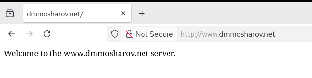{#fig:029}

Теперь обновим конфигурацию vagrant, поместив обновлённые конфиги и все созданные в ходе лабораторной работы файлы в папку /vagrant/provision/server. Кроме того, создадим скрипт http.sh (рис. [-@fig:030]).

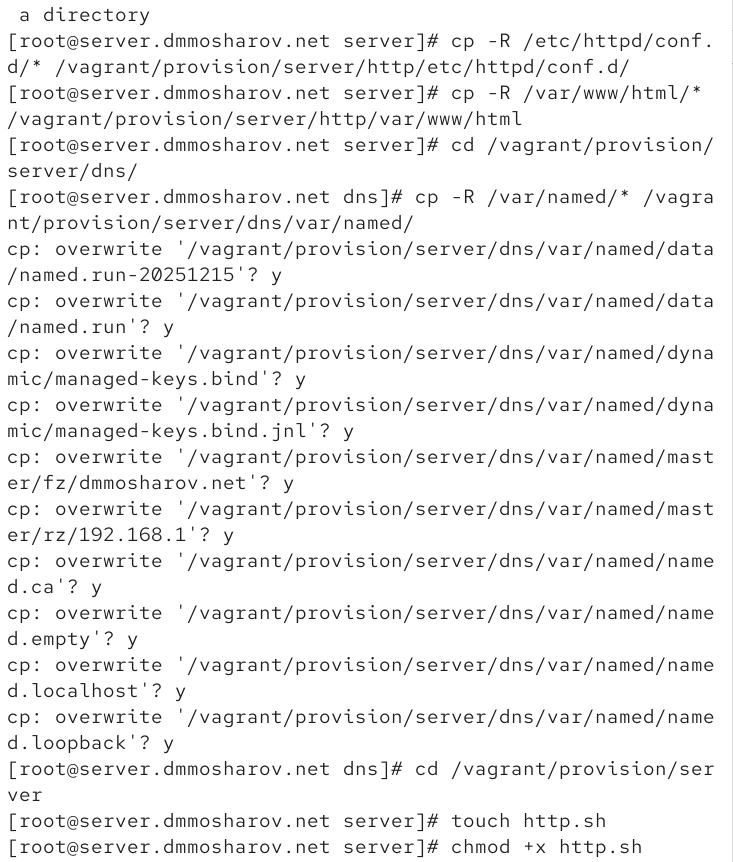{#fig:030}

В скрипт http.sh пропишем следующее содержимое, позволяющее настроить наш http сервер (рис. [-@fig:031]).

{#fig:031}

Отредактируем Vagrantfile, добавив в его конфигурацию запуск созданного ранее скрипта (рис. [-@fig:032]).

{#fig:032}

# Выводы

В результате выполнения лабораторной работы были получены навыки работы и настройки http сервера