---
## Front matter
title: "Отчёт о лабораторной работе"
subtitle: "Лабораторная работа 6"
author: "Мошаров Денис Максимович"

## Generic otions
lang: ru-RU
toc-title: "Содержание"

## Bibliography
bibliography: bib/cite.bib
csl: pandoc/csl/gost-r-7-0-5-2008-numeric.csl

## Pdf output format
toc: true # Table of contents
toc-depth: 2
lof: true # List of figures
lot: true # List of tables
fontsize: 12pt
linestretch: 1.5
papersize: a4
documentclass: scrreprt
## I18n polyglossia
polyglossia-lang:
  name: russian4
  options:
	- spelling=modern
	- babelshorthands=true
polyglossia-otherlangs:
  name: english
## I18n babel
babel-lang: russian
babel-otherlangs: english
## Fonts
mainfont: IBM Plex Serif
romanfont: IBM Plex Serif
sansfont: IBM Plex Sans
monofont: IBM Plex Mono
mathfont: STIX Two Math
mainfontoptions: Ligatures=Common,Ligatures=TeX,Scale=0.94
romanfontoptions: Ligatures=Common,Ligatures=TeX,Scale=0.94
sansfontoptions: Ligatures=Common,Ligatures=TeX,Scale=MatchLowercase,Scale=0.94
monofontoptions: Scale=MatchLowercase,Scale=0.94,FakeStretch=0.9
mathfontoptions:
## Biblatex
biblatex: true
biblio-style: "gost-numeric"
biblatexoptions:
  - parentracker=true
  - backend=biber
  - hyperref=auto
  - language=auto
  - autolang=other*
  - citestyle=gost-numeric
## Pandoc-crossref LaTeX customization
figureTitle: "Рис."
tableTitle: "Таблица"
listingTitle: "Листинг"
lofTitle: "Список иллюстраций"
lotTitle: "Список таблиц"
lolTitle: "Листинги"
## Misc options
indent: true
header-includes:
  - \usepackage{indentfirst}
  - \usepackage{float} # keep figures where there are in the text
  - \floatplacement{figure}{H} # keep figures where there are in the text
---

# Цель работы

Приобретение практических навыков по установке и конфигурированию системы управления базами данных на примере программного обеспечения MariaDB.

# Выполнение лабораторной работы

Запустим наш сервер через vagrant (рис. [-@fig:001]).

{#fig:001}

Далее установим пакет MariaDB (рис. [-@fig:002]).

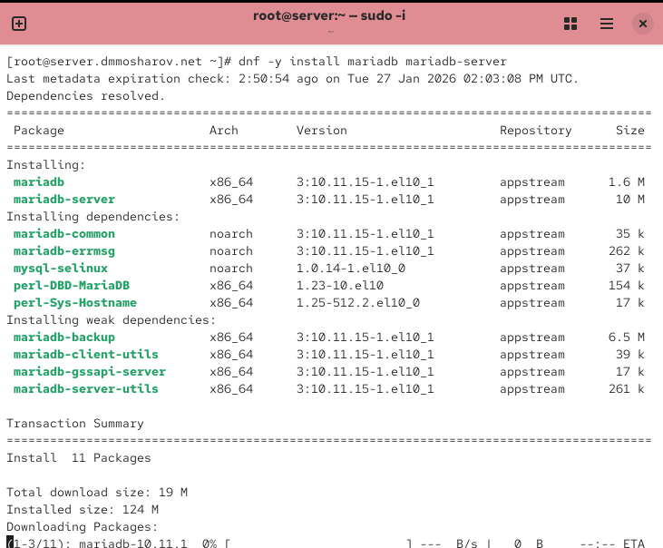{#fig:002}

Теперь рассмотрим основные конфигурационный файлы   
Файл: /etc/my.cnf   

Это главный конфигурационный файл MariaDB.   
client-server: Секция для настроек, которые применяются и к серверу, и к клиентам.   
!includedir /etc/my.cnf.d: Директива, которая говорит MariaDB загрузить все .cnf файлы из директории /etc/my.cnf.d. Это основной механизм подключения всех остальных файлов. (рис. [-@fig:003]).

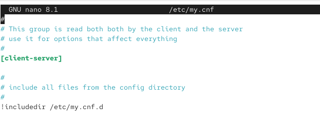{#fig:003}

Файл: auth_gssapi.cnf   
Файл для подключения плагина аутентификации GSSAPI (Kerberos).   
mariadb: Секция для настроек MariaDB.   
plugin-load-add=auth_gssapi.so: Закомментированная строка для загрузки плагина аутентификации GSSAPI. (рис. [-@fig:004]).

{#fig:004}

Файл: mariadb-server.cnf   
Основной файл конфигурации для самого сервера MariaDB.   
server, mysqld: Секции для настроек серверного процесса mysqld.   
datadir=/var/lib/mysql: Указывает директорию для хранения данных баз.   
socket=/var/lib/mysql/mysql.sock: Путь к файлу сокета для локальных подключений.   
log-error=/var/log/mariadb/mariadb.log: Файл для записи ошибок сервера.   
pid-file=/run/mariadb/mariadb.pid: Файл для хранения ID процесса сервера.   
galera: Секция для настройки Galera Cluster (система репликации).   
wsrep_on=ON: Включает поддержку репликации Galera.   
wsrep_provider=, wsrep_cluster_address=: Пустые параметры для пути к библиотеке Galera и адреса кластера.   
binlog_format=row, default_storage_engine=InnoDB, innodb_autoinc_lock_mode=2: Обязательные настройки для корректной работы Galera.   
bind-address=0.0.0.0: Закомментированная строка, которая позволила бы серверу принимать подключения со всех сетевых интерфейсов.   
wsrep_slave_threads=1, innodb_flush_log_at_trx_commit=0: Настройки производительности для репликации (рис. [-@fig:005]).

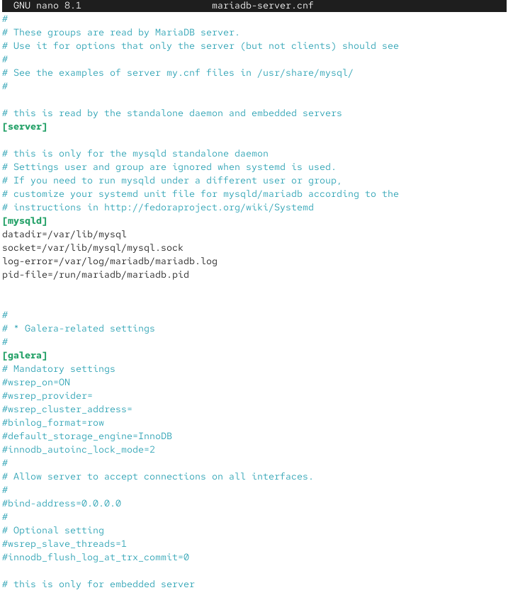{#fig:005}

Файл: provider_lz4.cnf   
server: Секция для настроек сервера.   
plugin_load_add=provider_lz4: Загружает плагин, предоставляющий алгоритм сжатия LZ4.   
provider_lz4=force_plus_permanent: Настраивает плагин так, чтобы он загружался принудительно и не мог быть выгружен. (рис. [-@fig:006]).

{#fig:006}

Файл: spider.cnf   
Файл для подключения движка хранилища Spider.   
mariadb: Секция для настроек MariaDB.   
plugin-load-add = ha_spider: Закомментированная строка для загрузки плагина Spider, который используется для шардинга (разделения данных по разным серверам) (рис. [-@fig:007]).

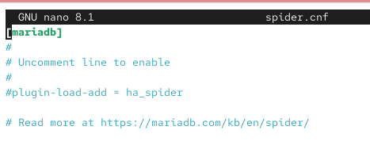{#fig:007}

Файл: client.cnf   
Конфигурация для клиентских приложений.   
client: Настройки для всех клиентских утилит (MySQL и MariaDB).   
client-mariadb: Настройки, которые применяются только к клиентам MariaDB. (рис. [-@fig:008]).

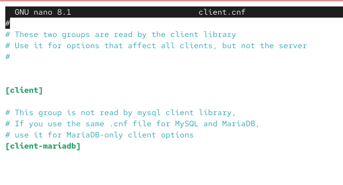{#fig:008}

Файл: mysql-clients.cnf   
Файл-шаблон для настройки отдельных клиентских утилит MariaDB.   
Содержит пустые секции, такие как mysql, mysql_upgrade, mysqldump, mysqladmin и другие. В них можно добавлять специфичные параметры для каждой утилиты. (рис. [-@fig:009]).

{#fig:009}

Файл: provider_lzo.cnf   
server: Секция для настроек сервера.   
plugin_load_add=provider_lzo: Загружает плагин, предоставляющий алгоритм сжатия LZO.   
provider_lzo=force_plus_permanent: Настраивает плагин так, чтобы он загружался принудительно и не мог быть выгружен. (рис. [-@fig:010]).

{#fig:010}

Файл: enable_encryption.preset   
Файл-пресет для включения шифрования данных "в состоянии покоя".   
mariadb: Секция для настроек MariaDB.   
aria-encrypt-tables, encrypt-binlog, encrypt-tmp-disk-tables, encrypt-tmp-files, loose-innodb-encrypt-log, loose-innodb-encrypt-tables: Директивы, включающие шифрование для таблиц Aria и InnoDB, бинарного лога и временных файлов. (рис. [-@fig:011]).

{#fig:011}

Файл: provider_bzip2.cnf   
server: Секция для настроек сервера.   
plugin_load_add=provider_bzip2: Загружает плагин, предоставляющий алгоритм сжатия bzip2.   
provider_bzip2=force_plus_permanent: Настраивает плагин так, чтобы он загружался принудительно и не мог быть выгружен. (рис. [-@fig:012]).

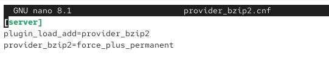{#fig:012}

Файл: provider_snappy.cnf   
server: Секция для настроек сервера.   
plugin_load_add=provider_snappy: Загружает плагин, предоставляющий алгоритм сжатия Snappy.   
provider_snappy=force_plus_permanent: Настраивает плагин так, чтобы он загружался принудительно и не мог быть выгружен. (рис. [-@fig:013]).

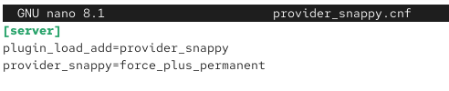{#fig:013}

Запустим службу mariadb и добавим её в автозагрузку. Также с помощью ss убедимся, что mariadb прослушивает 3306 порт (рис. [-@fig:014]).

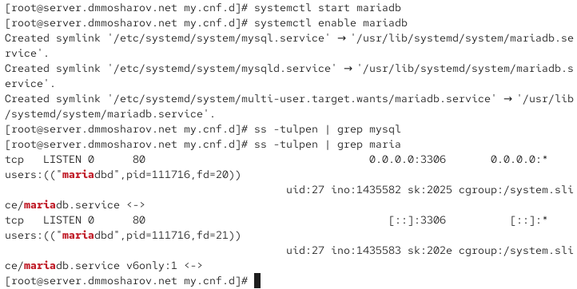{#fig:014}

Запустим команду mysql_secure_installation и настроим базу данных (рис. [-@fig:015]).

{#fig:015}

Теперь подключимся к базе данных и выведем справку. Как видим, всё работает (рис. [-@fig:016]).

{#fig:016}

Посмотрим на списки баз данных. На текущем этапе их всего 4 (рис. [-@fig:017]).

{#fig:017}

Получим статус работы БД. Далее, построчно проанализируем его:   

Информация о клиенте   
mysql Ver 15.1 Distrib 10.11.15-MariaDB, for Linux (x86_64) using EditLine wrapper   
Эта строка описывает программу, с помощью которой вы подключились. Это клиент mysql, который является частью дистрибутива MariaDB версии 10.11.15.   

Детали текущего сеанса   
Connection id: 14   
Уникальный номер вашего текущего подключения к серверу.
Current database:   
Название базы данных, которая выбрана в данный момент. Здесь она не выбрана.   
Current user: root@localhost   
Имя пользователя и хост, с которого выполнено подключение.   
SSL: Not in use   
Показывает, используется ли шифрование SSL/TLS для этого соединения. В данном случае — нет.   
Current pager: stdout   
Программа для постраничного вывода. stdout означает прямой вывод в консоль.   
Using outfile: ''   
Указывает, перенаправляется ли вывод в файл. В данном случае — нет.   
Using delimiter: ;   
Символ, который используется для завершения SQL-команд.   

Информация о сервере   
Server: MariaDB   
Тип сервера, к которому вы подключены.   
Server version: 10.11.15-MariaDB MariaDB Server   
Полная версия программного обеспечения сервера.   
Protocol version: 10   
Версия протокола, используемого для связи клиента и сервера.   
Connection: Localhost via UNIX socket   
Способ подключения. Здесь — локальное соединение через UNIX сокет, что очень эффективно.   
UNIX socket: /var/lib/mysql/mysql.sock   
Точный путь к файлу сокета, который используется для этого соединения.   

Настройки кодировок   
Server characterset: latin1   
Кодировка символов по умолчанию для всего сервера.   
Db characterset: latin1   
Кодировка символов по умолчанию для текущей базы данных.
Client characterset: utf8mb3   
Кодировка, в которой клиент отправляет запросы на сервер.   
Conn. characterset: utf8mb3   
Кодировка, установленная для текущего соединения.   

Статистика и время работы   
Uptime: 4 min 57 sec   
Общее время работы сервера с момента последнего запуска.   
Threads: 1 Questions: 27 Slow queries: 0 Opens: 20 Open tables: 13 Queries per second avg: 0.090   
Краткая статистика производительности:   
1 активное подключение (поток).   
27 запросов было выполнено с момента запуска.   
0 медленных запросов.   
20 раз сервер открывал файлы таблиц.   
13 таблиц открыто в данный момент.   
0.090 — среднее количество запросов в секунду (рис. [-@fig:018]).

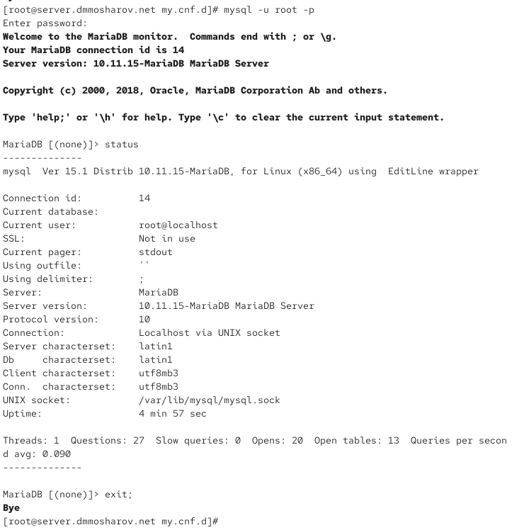{#fig:018}

Перейдём в каталог /etc/my.cnf.d и создадим файл utf8.cnf (рис. [-@fig:019]).

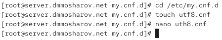{#fig:019}

Поместим в него следующие строки. Тут мы указываем, что хотим видеть кодировку utf9 по умолчанию (рис. [-@fig:020]).

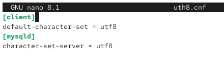{#fig:020}

Перезапустим mariadb и войдём снова в БД. Теперь посмотрим ещё раз статус БД и увидим, что кодировка сменилась с latin1 на utf8 (рис. [-@fig:021]).

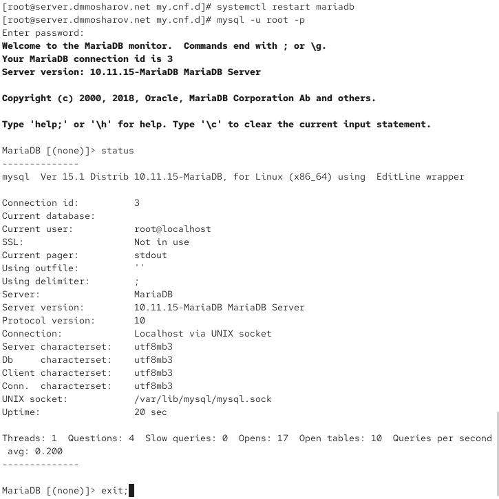{#fig:021}

Теперь создадим базу данных addressbook , перейдём в неё и убедимся, что она пустая. После этого создадим в ней таблицу city и добавим в неё три записи: Иванов, Петров, Сидоров. Выведем эту таблицу (рис. [-@fig:022]).

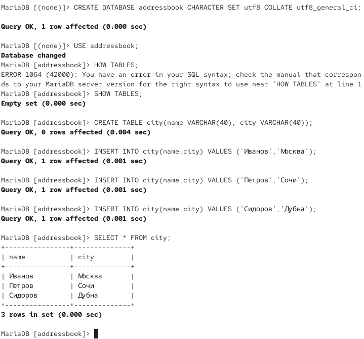{#fig:022}

Теперь создадим пользователя dmmosharov и предоставим ему доступ к этой таблице, после чего убедимся, что количество баз данных увеличилось с 4 до 5. После этого попробуем показать базу данных addressbook от имени рута и от имени созданного нами пользователя. Как видим, операция успешна, а значит, пользователь имеет доступ к БД (рис. [-@fig:023]).

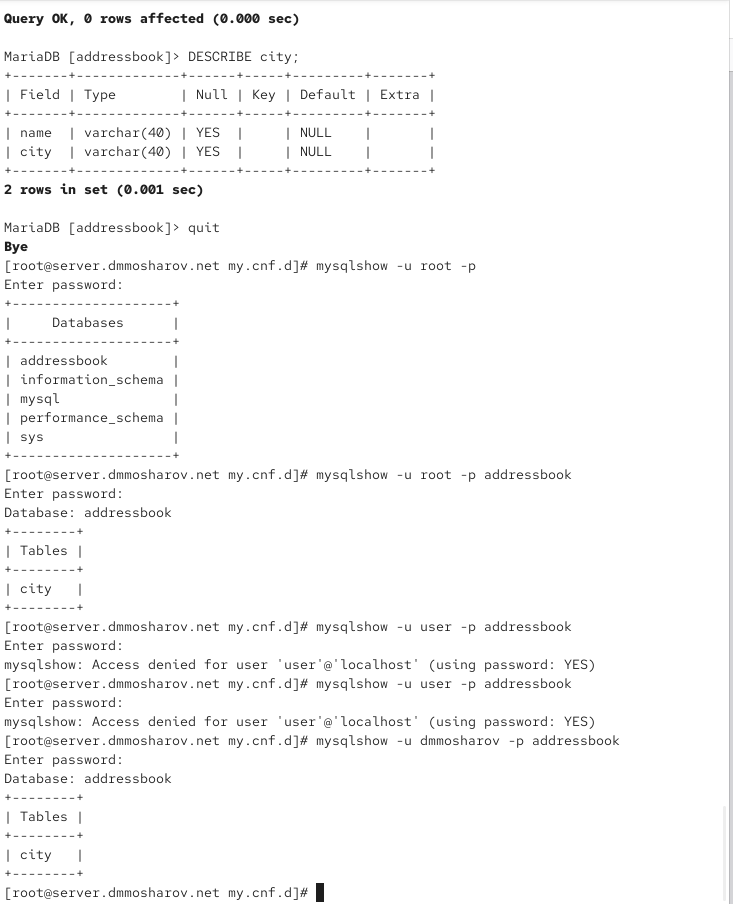{#fig:023}

Теперь попробуем теперь сделать бэкапы и откатиться на них. Мы создадим обычный бэкап, сжатый и с таймстемпом. После этого сохраним все конфигурационные файлы в vagrant (рис. [-@fig:024]).

{#fig:024}

В созданном скрипте mysql.sh пропишем следующие строки (рис. [-@fig:025]).

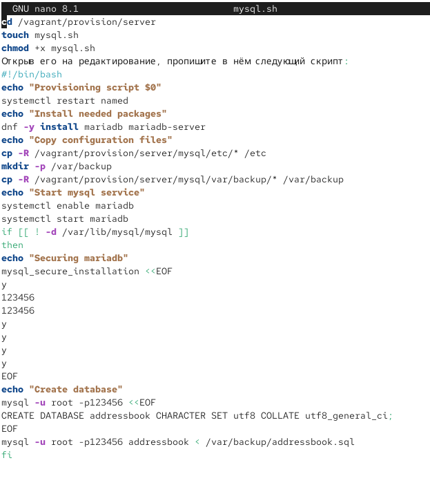{#fig:025}

И запишем в vagrantfile автозагрузку этого скрипта (рис. [-@fig:026]).

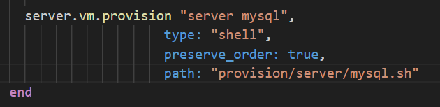{#fig:026}

# Выводы

В результате выполнения лабораторной работы были получены навыки работы с базами данных и их настройкой