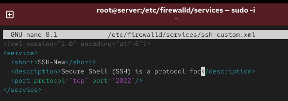
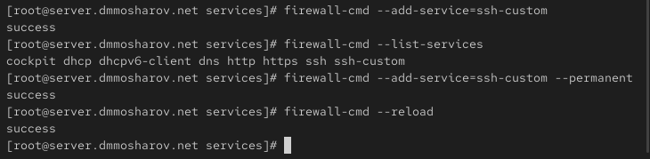
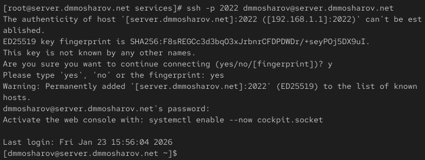
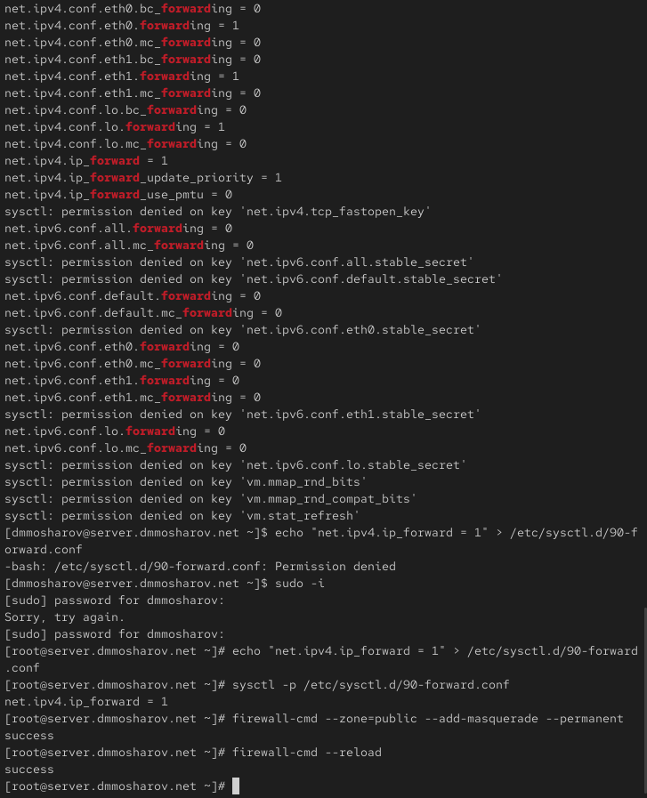
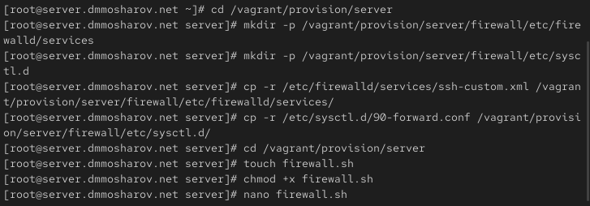
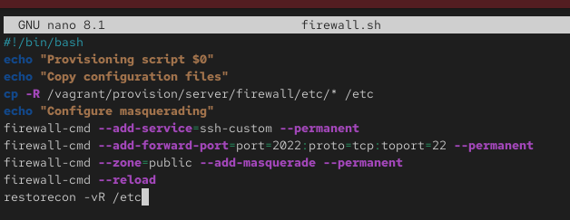

---
## Front matter
title: "Отчёт о лабораторной работе"
subtitle: "Лабораторная работа 7"
author: "Мошаров Денис Максимович"

## Generic otions
lang: ru-RU
toc-title: "Содержание"

## Bibliography
bibliography: bib/cite.bib
csl: pandoc/csl/gost-r-7-0-5-2008-numeric.csl

## Pdf output format
toc: true # Table of contents
toc-depth: 2
lof: true # List of figures
lot: true # List of tables
fontsize: 12pt
linestretch: 1.5
papersize: a4
documentclass: scrreprt
## I18n polyglossia
polyglossia-lang:
  name: russian4
  options:
	- spelling=modern
	- babelshorthands=true
polyglossia-otherlangs:
  name: english
## I18n babel
babel-lang: russian
babel-otherlangs: english
## Fonts
mainfont: IBM Plex Serif
romanfont: IBM Plex Serif
sansfont: IBM Plex Sans
monofont: IBM Plex Mono
mathfont: STIX Two Math
mainfontoptions: Ligatures=Common,Ligatures=TeX,Scale=0.94
romanfontoptions: Ligatures=Common,Ligatures=TeX,Scale=0.94
sansfontoptions: Ligatures=Common,Ligatures=TeX,Scale=MatchLowercase,Scale=0.94
monofontoptions: Scale=MatchLowercase,Scale=0.94,FakeStretch=0.9
mathfontoptions:
## Biblatex
biblatex: true
biblio-style: "gost-numeric"
biblatexoptions:
  - parentracker=true
  - backend=biber
  - hyperref=auto
  - language=auto
  - autolang=other*
  - citestyle=gost-numeric
## Pandoc-crossref LaTeX customization
figureTitle: "Рис."
tableTitle: "Таблица"
listingTitle: "Листинг"
lofTitle: "Список иллюстраций"
lotTitle: "Список таблиц"
lolTitle: "Листинги"
## Misc options
indent: true
header-includes:
  - \usepackage{indentfirst}
  - \usepackage{float} # keep figures where there are in the text
  - \floatplacement{figure}{H} # keep figures where there are in the text
---

# Цель работы

Получить навыки настройки межсетевого экрана в Linux в части переадресации портов и настройки Masquerading.

# Выполнение лабораторной работы

Запустим наш сервер через vagrant (рис. [-@fig:001]).

{#fig:001}

Теперь зайдём под суперпользователем и скопируем файл описания службы ssh, создав его копию с названием ssh-custom.xml (рис. [-@fig:002]).

{#fig:002}

Теперь изменим его следующим образом. Основное отличие заключается в том, что порт для tcp назначен как 2022. 
Это XML-файл, который определяет пользовательскую службу для брандмауэра firewalld в Linux. Построчно опишем его:   
Строка 1: xml version="1.0" encoding="utf-8"   
Это стандартное объявление XML. Оно указывает, что файл использует версию XML 1.0 и кодировку символов UTF-8.   

Строка 2: service   
Это открывающий тег для корневого элемента. Он означает начало определения новой службы для firewalld.   

Строка 3: short SSH-New /short   
Этот тег задает короткое, удобное для чтения имя службы. В данном случае имя — "SSH-New".   

Строка 4: description Long SSH description /description   
Здесь содержится более подробное описание службы. В этом примере используется текст "Long SSH description" (Длинное описание SSH).   

Строка 5: port protocol="tcp" port="2022"/   
Это ключевая строка. Она определяет, что данная служба использует протокол tcp и слушает порт 2022. Когда эта служба будет активирована в firewalld, брандмауэр откроет порт 2022 для входящих TCP-соединений.   

Строка 6: /service   
Это закрывающий тег, который завершает определение службы. (рис. [-@fig:003]).

{#fig:003}

Выведем список доступных служб firewalld. Нашей созданной службы тут нет (рис. [-@fig:004]).

{#fig:004}

Теперь перезапустим firewalld и снова выведем список доступных служб. Теперь наша служба отображается. Попробуем вывести список активных служб и увидим, что нашей службы пока в нём нет (рис. [-@fig:005]).

{#fig:005}

Запустим созданную нами службу ssh-custom. Убедимся, что она запущена и находится в списке активных служб, после чего добавим её как постоянную службу, и перезагрузим firewalld (рис. [-@fig:006]).

{#fig:006}

С помощью firewalld настроим форвардинг портов с 2022 на 22 (рис. [-@fig:007]).

{#fig:007}

Попробуем с клиента подключиться по ssh к серверу, используя именно 2022 порт. Как видим, операция прошла успешно (рис. [-@fig:008]).

{#fig:008}

Проверим, включена ли в ядре опция перенаправления ipv4 пакетов. Как видим, переключатель стоит в положении 0. Запишем настройку net.ipv4.ip_forward = 1 в файл конфигурации /etc/sysctl.d/90-forward.conf. После этого загружаем этот конфигурационный файл и включаем через firewall-cmd маскарадинг (рис. [-@fig:009]).

{#fig:009}

Теперь с клиента попробуем зайти в сеть интернет. Как видим, интернет работает (рис. [-@fig:010]).

{#fig:010}

После этого сохраним все конфигурационные файлы в vagrant и создадим скрипт firewall.sh (рис. [-@fig:011]).

{#fig:011}

В созданном скрипте firewall.sh пропишем следующие строки для настройки ssh и маскарадинга (рис. [-@fig:012]).

{#fig:012}

И запишем в vagrantfile автозагрузку этого скрипта (рис. [-@fig:013]).

{#fig:013}

# Выводы

В результате выполнения лабораторной работы были получены навыки работы с фаерволом и настройкой форвардинга и маскарадинга