---
## Front matter
title: "Отчёт о лабораторной работе"
subtitle: "Лабораторная работа 8"
author: "Мошаров Денис Максимович"

## Generic otions
lang: ru-RU
toc-title: "Содержание"

## Bibliography
bibliography: bib/cite.bib
csl: pandoc/csl/gost-r-7-0-5-2008-numeric.csl

## Pdf output format
toc: true # Table of contents
toc-depth: 2
lof: true # List of figures
lot: true # List of tables
fontsize: 12pt
linestretch: 1.5
papersize: a4
documentclass: scrreprt
## I18n polyglossia
polyglossia-lang:
  name: russian4
  options:
	- spelling=modern
	- babelshorthands=true
polyglossia-otherlangs:
  name: english
## I18n babel
babel-lang: russian
babel-otherlangs: english
## Fonts
mainfont: IBM Plex Serif
romanfont: IBM Plex Serif
sansfont: IBM Plex Sans
monofont: IBM Plex Mono
mathfont: STIX Two Math
mainfontoptions: Ligatures=Common,Ligatures=TeX,Scale=0.94
romanfontoptions: Ligatures=Common,Ligatures=TeX,Scale=0.94
sansfontoptions: Ligatures=Common,Ligatures=TeX,Scale=MatchLowercase,Scale=0.94
monofontoptions: Scale=MatchLowercase,Scale=0.94,FakeStretch=0.9
mathfontoptions:
## Biblatex
biblatex: true
biblio-style: "gost-numeric"
biblatexoptions:
  - parentracker=true
  - backend=biber
  - hyperref=auto
  - language=auto
  - autolang=other*
  - citestyle=gost-numeric
## Pandoc-crossref LaTeX customization
figureTitle: "Рис."
tableTitle: "Таблица"
listingTitle: "Листинг"
lofTitle: "Список иллюстраций"
lotTitle: "Список таблиц"
lolTitle: "Листинги"
## Misc options
indent: true
header-includes:
  - \usepackage{indentfirst}
  - \usepackage{float} # keep figures where there are in the text
  - \floatplacement{figure}{H} # keep figures where there are in the text
---

# Цель работы

Приобретение практических навыков по установке и конфигурированию SMTP-сервера

# Выполнение лабораторной работы

Для начала перейдём на сервере под учётную запись root и установим postfix (рис. [-@fig:001]).

{#fig:001}

Далее, установим s-nail (рис. [-@fig:002]).

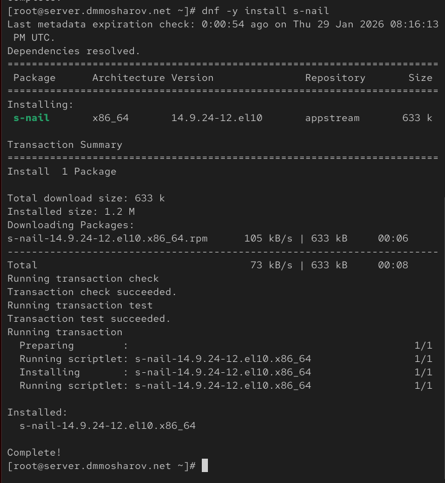{#fig:002}

Далее добавим правило фаервола для разрешения работы smtp протокола и восстановим метки selinux, после чего включим postfix (рис. [-@fig:003]).

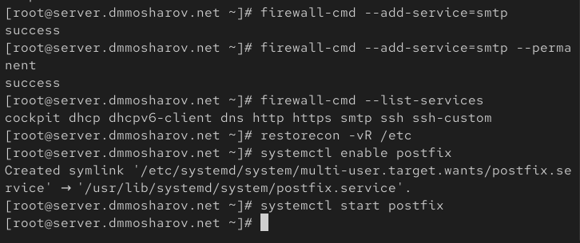{#fig:003}

Введём команду postconf. Она выводит список всех параметров настроек. Вывод довольно большой (рис. [-@fig:004]).

{#fig:004}

Посмотрим, чему равняется значение myorigin и значение mydomain. Имя домена это наше доменное имя, а myorigin это имя хоста. Поменяем его на имя домана, проверим обновление конфигурации на корректность с помощью postfix check и перезагрузим postfix (рис. [-@fig:005]).

{#fig:005}

С помощью postfix -n выведем конфигурации, которые не соответствуют конфигурациям по умолчанию (рис. [-@fig:006]).

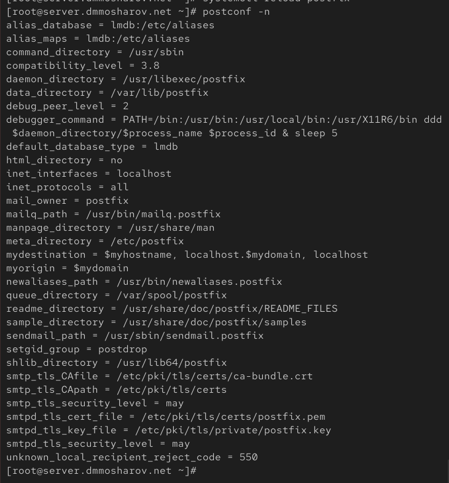{#fig:006}

Захардкодим имя домена как наш домен. После этого посмотрим на то, какие протоколы интернет допустимы. Как видим, все. Сделаем так, чтобы допустим был только ipv4 и перезагрузим postfix (рис. [-@fig:007]).

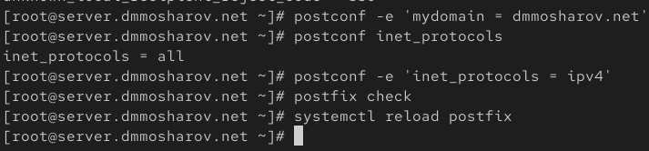{#fig:007}

Попробуем от имени своей учётной записи отправить себе же письмо (рис. [-@fig:008]).

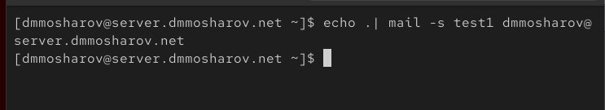{#fig:008}

Откроем в другой вкладке лог, который считывается из файла /var/log/maillog. Как видим, почтовое сообщение было доставлено. Об этом можно судить по сообщению, которое идёт перед последним и гласит "delivered tp mailbox" (рис. [-@fig:009]).

{#fig:009}

Убедимся также, что в папке /var/spool/mail создались файлы наших пользователей (рис. [-@fig:010]).

{#fig:010}

Перейдём в клиентскую машину, зайдём под рутом и тоже установим postfix (рис. [-@fig:011]).

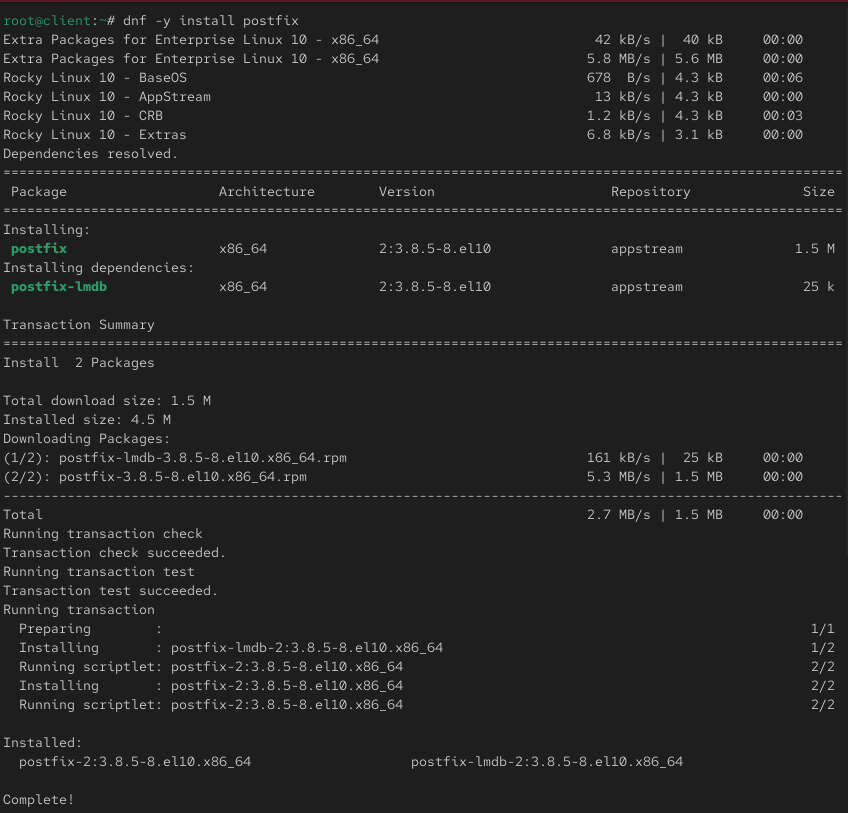{#fig:011}

Также установим s-nail (рис. [-@fig:012]).

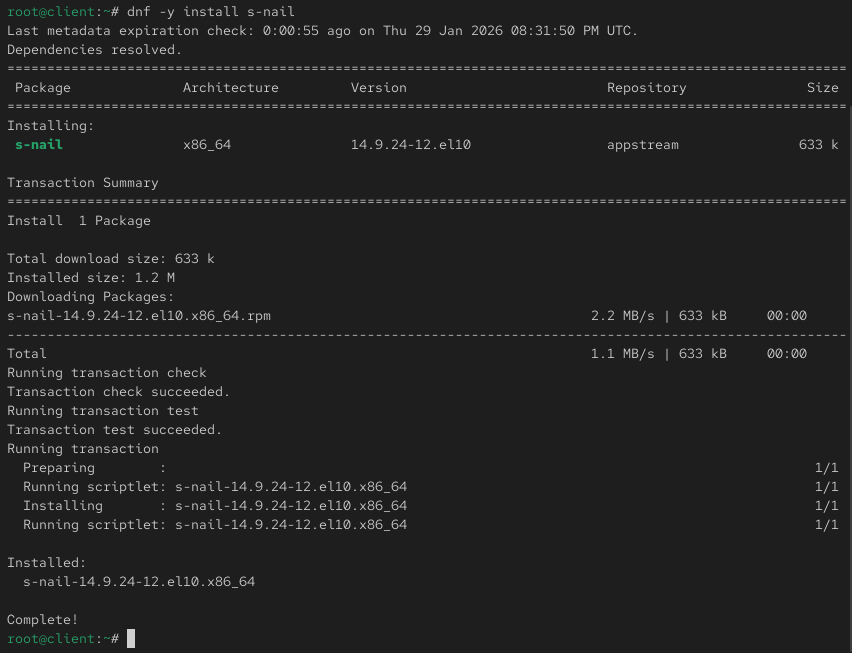{#fig:012}

На клиенте, ровно так же, как мы делали на сервере, включим только ipv4 в качестве рабочего протокола и перезагрузим postfix (рис. [-@fig:013]).

{#fig:013}

Теперь отправим с клиента письмо на сервер (рис. [-@fig:014]).

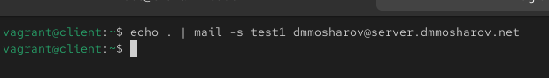{#fig:014}

На сервере мы ничего нового не увидим (рис. [-@fig:015]).

{#fig:015}

Позволим другим устройствам в сети отправлять почту серверу. Для этого поменяем параметр inet_interfaces с localhost на all, а также добавим в mynetworks нашу локальную сеть 192.168.0.0, после чего перезагрузим postfix (рис. [-@fig:016]).

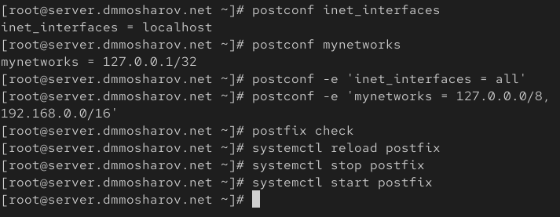{#fig:016}

Попробуем на клиенте снова отправить письмо (рис. [-@fig:017]).

{#fig:017}

Теперь, как мы видим, появилось новое письмо. Как видим, в предпоследней строке сказано, что оно успешно доставлено (delivered to mailbox) (рис. [-@fig:018]).

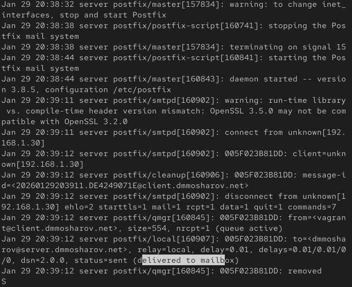{#fig:018}

Теперь отправим письмо не на конкретное устройство, а к пользователю (рис. [-@fig:019]).

{#fig:019}

Как видим, наше письмо не доставилось, потому что нет информации о каком-либо почтовом сервере (No route to host) (рис. [-@fig:020]).

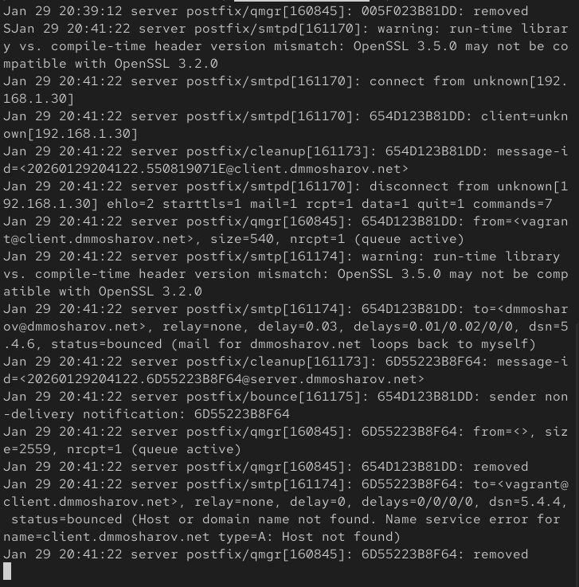{#fig:020}

Мы увидим информацию об этом зависшем письме через команду postqueue -p (рис. [-@fig:021]).

{#fig:021}

Теперь поменяем файлы прямой и обратной зоны для добавления информации о почтовом сервере. В файле прямой зоны будут такие изменения (добавление записи о почтовом сервере) (рис. [-@fig:022]).

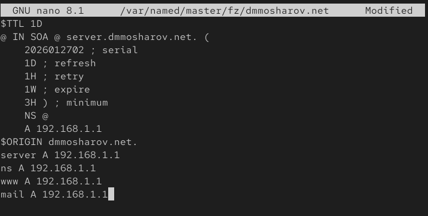{#fig:022}

А в файле обратной зоны будут такие изменения (рис. [-@fig:023]).

{#fig:023}

Обновим список пунктов назначения, включив туда сервер, после чего перезагрузим postfix и обновив метки selinux, а так же перезагрузив dns сервер, после чего введём postqueue -f, чтобы выгрузить нашу очередь сообщений (рис. [-@fig:024]).

{#fig:024}

Теперь мы увидим, что наше письмо было доставлено (рис. [-@fig:025]).

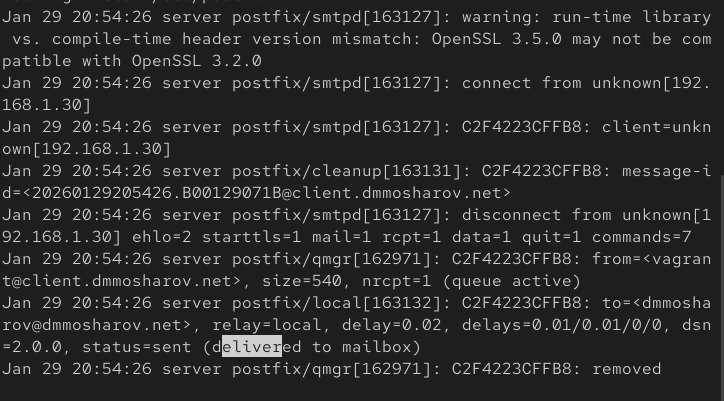{#fig:025}

Теперь сохраним конфигурацию для vagrant с сервера, а также создадим файл mail.sh (рис. [-@fig:026]).

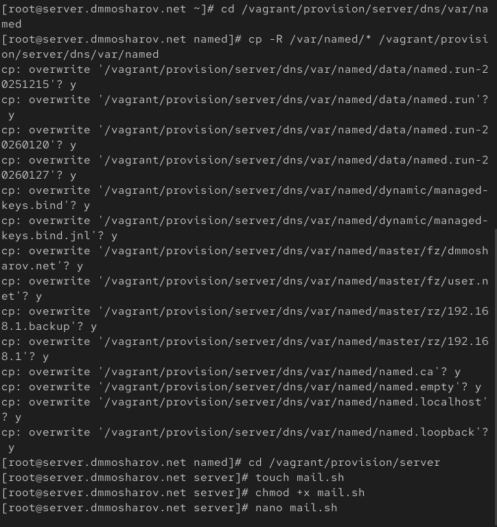{#fig:026}

В файл mail.sh напишем следующий скрипт (рис. [-@fig:027]).

{#fig:027}

Теперь переключимся на клиент, где также создадим файл mail.sh для vagrant (рис. [-@fig:028]).

{#fig:028}

Скрипт для клиента будет выглядеть так (рис. [-@fig:029]).

{#fig:029}

Теперь зайдём в vagrantfile и добавим запуск этих скриптов для клиента и сервера (рис. [-@fig:029]).

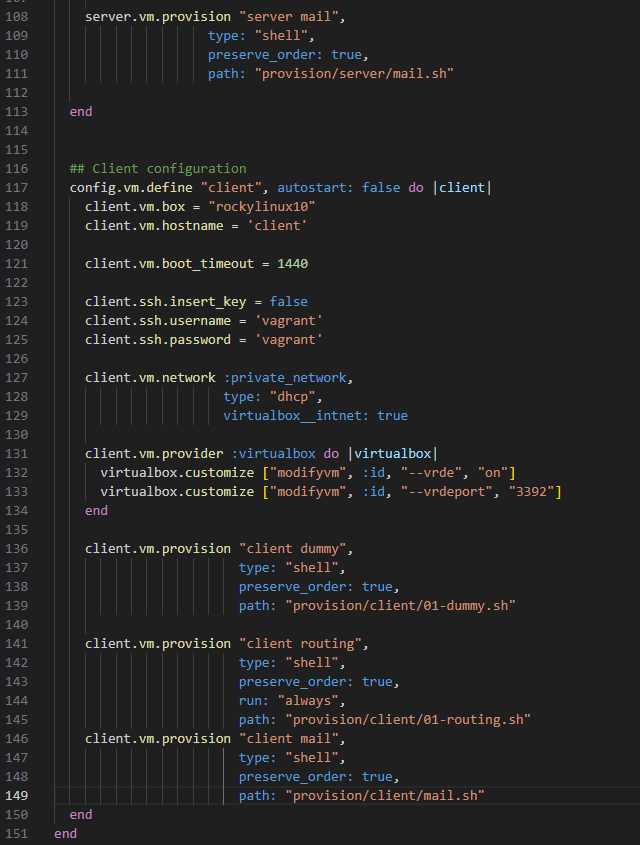{#fig:030}

# Выводы

В результате выполнения лабораторной работы были получены навыки настройки smtp сервера