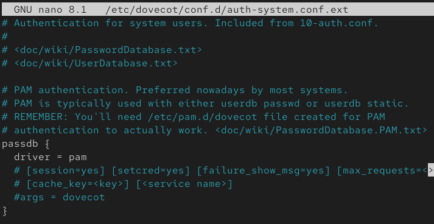
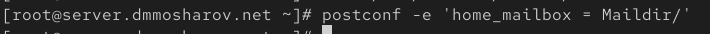
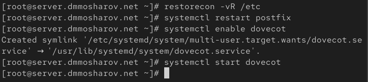
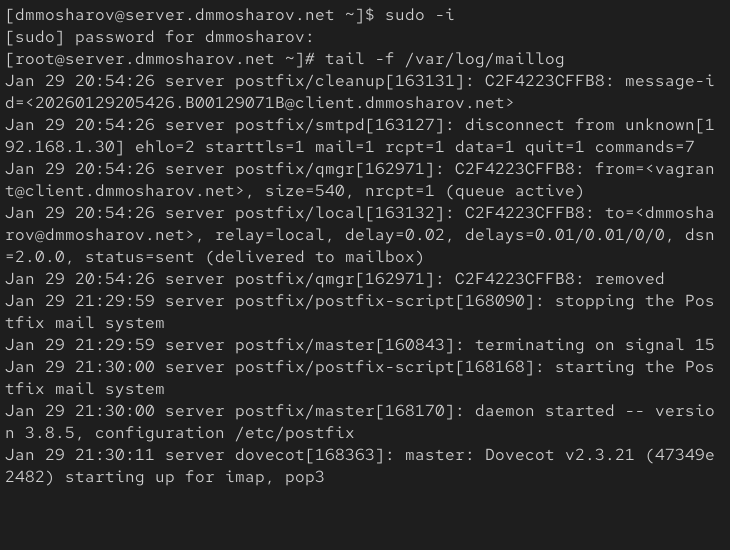
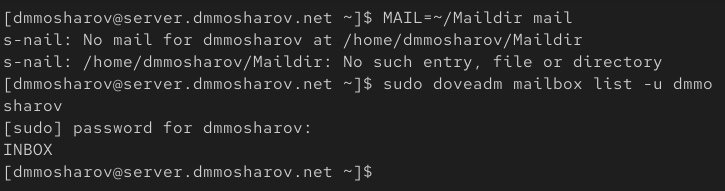
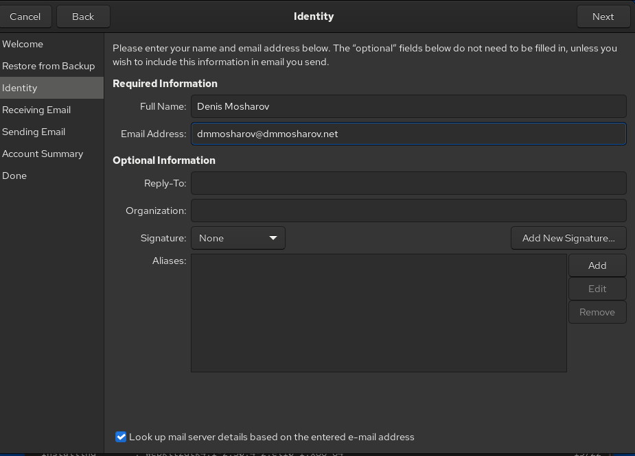
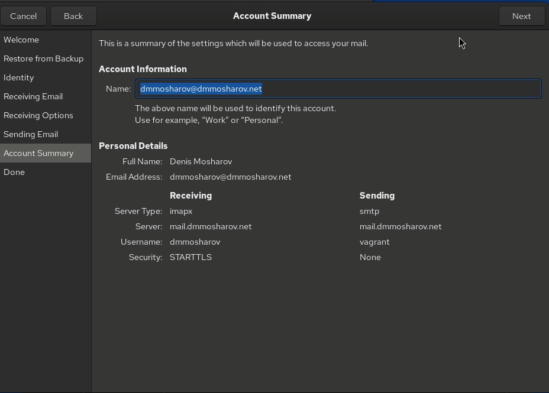
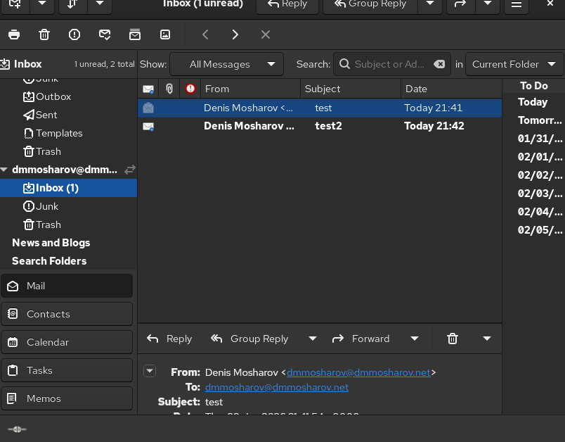

---
## Front matter
title: "Отчёт о лабораторной работе"
subtitle: "Лабораторная работа 9"
author: "Мошаров Денис Максимович"

## Generic otions
lang: ru-RU
toc-title: "Содержание"

## Bibliography
bibliography: bib/cite.bib
csl: pandoc/csl/gost-r-7-0-5-2008-numeric.csl

## Pdf output format
toc: true # Table of contents
toc-depth: 2
lof: true # List of figures
lot: true # List of tables
fontsize: 12pt
linestretch: 1.5
papersize: a4
documentclass: scrreprt
## I18n polyglossia
polyglossia-lang:
  name: russian4
  options:
	- spelling=modern
	- babelshorthands=true
polyglossia-otherlangs:
  name: english
## I18n babel
babel-lang: russian
babel-otherlangs: english
## Fonts
mainfont: IBM Plex Serif
romanfont: IBM Plex Serif
sansfont: IBM Plex Sans
monofont: IBM Plex Mono
mathfont: STIX Two Math
mainfontoptions: Ligatures=Common,Ligatures=TeX,Scale=0.94
romanfontoptions: Ligatures=Common,Ligatures=TeX,Scale=0.94
sansfontoptions: Ligatures=Common,Ligatures=TeX,Scale=MatchLowercase,Scale=0.94
monofontoptions: Scale=MatchLowercase,Scale=0.94,FakeStretch=0.9
mathfontoptions:
## Biblatex
biblatex: true
biblio-style: "gost-numeric"
biblatexoptions:
  - parentracker=true
  - backend=biber
  - hyperref=auto
  - language=auto
  - autolang=other*
  - citestyle=gost-numeric
## Pandoc-crossref LaTeX customization
figureTitle: "Рис."
tableTitle: "Таблица"
listingTitle: "Листинг"
lofTitle: "Список иллюстраций"
lotTitle: "Список таблиц"
lolTitle: "Листинги"
## Misc options
indent: true
header-includes:
  - \usepackage{indentfirst}
  - \usepackage{float} # keep figures where there are in the text
  - \floatplacement{figure}{H} # keep figures where there are in the text
---

# Цель работы

Приобретение практических навыков по установке и простейшему конфигурированию POP3/IMAP-сервера

# Выполнение лабораторной работы

Зайдём на виртуальную машину server и установим пакеты dovecot и telnet (рис. [-@fig:001]).

{#fig:001}

Откроем конфигурационый файл /etc/dovecot/dovecot.conf и задидим параметру protocols значение двух почтовых протоколов, которые рассматриваются в данной лабораторной работе - imap и pop3 (рис. [-@fig:002]).

{#fig:002}

Перейдём в файл /etc/dovecot/conf.d/10-auth.conf и убедимся в том, что параметр auth_mechanisms имеет значение plain (рис. [-@fig:003]).

{#fig:003}

Откроем файл /etc/dovecot/conf.d/auth-system.conf.ext и убедимся, что параметр driver для passwd равен pam (рис. [-@fig:004]).

{#fig:004}

В том же файле убедимся, что параметр driver для userdb равен passwd (рис. [-@fig:005]).

{#fig:005}

Откроем файл /etc/dovecot/conf.d/10-mail.conf и укажем параметр для mail_location (рис. [-@fig:006]).

{#fig:006}

Теперь сконфигурируем postfix. Назначим параметр home_mailbox равный Maildir (рис. [-@fig:007]).

{#fig:007}

Настроим firewall. Разрешим работу с протоколами pop3 и imap (рис. [-@fig:008]).

{#fig:008}

Далее восстановим метки SElinux и перезапусим postfix, после чего включим dovecot (рис. [-@fig:009]).

{#fig:009}

На дополнительном терминале начнём отслеживать в реальном времени вывод логов из файла /var/log/maillog, связанный с почтовой службой (рис. [-@fig:010]).

{#fig:010}

С помощью команд mail и doveadm посмотрим данные о почте и почтовом ящике. Как видим, у пользователя есть почтовый ящик INBOX (судя по doveadm). Вывод команды mail показывает, что папки с почтой нет для нашего пользователя. Это связано с тем, что к нему не приходило ни одного письма, чтобы эта папка создалась (рис. [-@fig:011]).

{#fig:011}

Теперь запустим машину client. Установим на неё почтовый клиент evolution (рис. [-@fig:012]).

{#fig:012}

После открытия данной программы мы увидем окно с предложением настроить клиент. Во вкладке identity введём свои данные (рис. [-@fig:013]).

{#fig:013}

Во вкладке recieving email мы должны настроить входящую почту. За неё будет отвечать протокол imap на порту 143. Аутентификация будет простая по поролю, а метод шифрования выбран как STARTTLS after connecting (рис. [-@fig:014]).

{#fig:014}

Теперь заполним вкладку sending email. Это исходящая почта, и за отправку будет отвечать протокол pop3 на порту 25, без шифрования и авторизации (рис. [-@fig:015]).

{#fig:015}

В account summary убедимся, что всё настроено верно (рис. [-@fig:016]).

{#fig:016}

После продолжения у нас спросят про сертификат безопасности. Мы выбираем опцию постоянно доверять сертификату и соединению (рис. [-@fig:017]).

{#fig:017}

Напишем себе какое-нибудь письмо, например такое, с темой test и телом test (рис. [-@fig:018]).

{#fig:018}

Напишем второе письмо с темой test2 и без тела (рис. [-@fig:019]).

{#fig:019}

Убедимся, что письма были отправлены и успешно доставлены. Мы можем судить об этом по тому, что письма появились в ящике inbox, то есть доставка была успешна (рис. [-@fig:020]).

{#fig:020}

Посмотрим, что появилось в логах на сервере. Как мы видим, сервер успешно обработал 2 письма с двумя разными идентификаторами. Мы можем судить об успешной отправке по припискам delivered to maildir (рис. [-@fig:021]).

{#fig:021}

Теперь посмотрим на вывод mail и doveadm. mail теперь успешно показывает 2 письма с теми же темами, что мы указали. doveadm же пишет о наличии почтового ящика inbox (рис. [-@fig:022]).

{#fig:022}

Теперь с помощью telnet подключимся к почтовому серверу. Залогинемся под нашим пользователем, и с помощью команды list нам выведет список из двух элементов - наших писем. С помощью команды retr мы прочитаем содержимое первого письма. Как видим, оно содержит ряд данных, а именно, куда отправить, кому доставлено, от кого получено, айди, тема, дата, тело и прочие характеристики. Командой dele мы удалим второе сообщение и выйдем с помощью команды quit (рис. [-@fig:023]).

{#fig:023}

Теперь сохраним все данные конфигураций в vagrant. Кроме того, модифицируем скрипт mail.sh (рис. [-@fig:024]).

{#fig:024}

В mail.sh добавим строки, отвечающие за установку пакетов, настройку фаервола, настройку postfix и его перезапуск, а также запуск службы dovecot (рис. [-@fig:025]).

{#fig:025}

На клиенте тоже отредактируем файл mail.sh. Добавим в него строку об установку почтового клиента evolution (рис. [-@fig:026]).

{#fig:026}

# Выводы

В результате выполнения лабораторной работы были получены навыки настройки и использования простейшего imap/pop3 сервера