---
## Front matter
title: "Отчёт о лабораторной работе"
subtitle: "Лабораторная работа 10"
author: "Мошаров Денис Максимович"

## Generic otions
lang: ru-RU
toc-title: "Содержание"

## Bibliography
bibliography: bib/cite.bib
csl: pandoc/csl/gost-r-7-0-5-2008-numeric.csl

## Pdf output format
toc: true # Table of contents
toc-depth: 2
lof: true # List of figures
lot: true # List of tables
fontsize: 12pt
linestretch: 1.5
papersize: a4
documentclass: scrreprt
## I18n polyglossia
polyglossia-lang:
  name: russian4
  options:
	- spelling=modern
	- babelshorthands=true
polyglossia-otherlangs:
  name: english
## I18n babel
babel-lang: russian
babel-otherlangs: english
## Fonts
mainfont: IBM Plex Serif
romanfont: IBM Plex Serif
sansfont: IBM Plex Sans
monofont: IBM Plex Mono
mathfont: STIX Two Math
mainfontoptions: Ligatures=Common,Ligatures=TeX,Scale=0.94
romanfontoptions: Ligatures=Common,Ligatures=TeX,Scale=0.94
sansfontoptions: Ligatures=Common,Ligatures=TeX,Scale=MatchLowercase,Scale=0.94
monofontoptions: Scale=MatchLowercase,Scale=0.94,FakeStretch=0.9
mathfontoptions:
## Biblatex
biblatex: true
biblio-style: "gost-numeric"
biblatexoptions:
  - parentracker=true
  - backend=biber
  - hyperref=auto
  - language=auto
  - autolang=other*
  - citestyle=gost-numeric
## Pandoc-crossref LaTeX customization
figureTitle: "Рис."
tableTitle: "Таблица"
listingTitle: "Листинг"
lofTitle: "Список иллюстраций"
lotTitle: "Список таблиц"
lolTitle: "Листинги"
## Misc options
indent: true
header-includes:
  - \usepackage{indentfirst}
  - \usepackage{float} # keep figures where there are in the text
  - \floatplacement{figure}{H} # keep figures where there are in the text
---

# Цель работы

Приобретение практических навыков по конфигурированию SMTP-сервера в части настройки аутентификации

# Выполнение лабораторной работы

Во втором терминале сервера запустим вывод логов почты (рис. [-@fig:001]).

{#fig:001}

В первом же терминале сервера авторизуемся под рутом и откроем файл конфигурации /etc/dovecot/dovecot.conf (рис. [-@fig:002]).

{#fig:002}

В этом файле допишем в список рабочих протоколов протокол lmtp (рис. [-@fig:003]).

{#fig:003}

Далее, откроем конфигурационный файл /etc/dovecot/conf.d/10-master.conf (рис. [-@fig:004]).

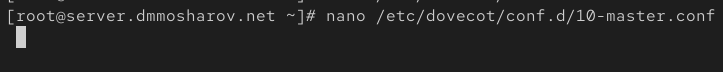{#fig:004}

Внутри этого файла пропишем следующее тело для структуры service lmtp (рис. [-@fig:005]).

{#fig:005}

Далее, пропишем в postfix сокет, через который будет идти отправка сообщений. После этого откроем файл /etc/dovecot/conf.d/10-auth.conf (рис. [-@fig:006]).

{#fig:006}

В этом файле зададим значение для поля auth\_username\_format, отвечающее за формат имени пользователя для аутентификации. В нашем случае домен не будет указываться  (рис. [-@fig:007]).

{#fig:007}

Перезапустим postfix и dovecot (рис. [-@fig:008]).

{#fig:008}

Теперь перейдём на виртуальную машину клиента. Попробуем отправить письмо самому себе (рис. [-@fig:009]).

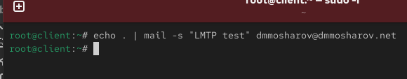{#fig:009}

В логах, которые мы открывали на сервере в самом начале выполнения лабораторной работы, мы видим, что письмо было доставлено в ящик. Об этом свидетельствует подпись "saved mail to INBOX". Кроме того, теперь в логах пишется, что транспортировка осуществляется через lmtp (passing ... to transport=lmtp) (рис. [-@fig:010]).

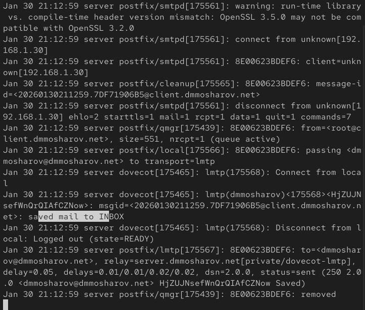{#fig:010}

Откроем на сервере почтовый ящик, чтобы убедится, что письмо успешно доставлено. Как видим, это действительно так (рис. [-@fig:011]).

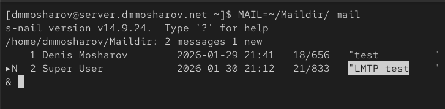{#fig:011}

Теперь откроем файл конфигурации по пути /etc/dovecot/conf.d/10-master.conf (рис. [-@fig:012]).

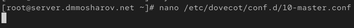{#fig:012}

Приведем содержание тела структуры service auth к следующему виду. Разберём построчно   

    service auth { ... } - Эта строка объявляет начало секции конфигурации для внутренней службы Dovecot, которая называется auth.   

    unix_listener /var/spool/postfix/private/auth { ... } - Указывает Dovecot создать "слушателя" на основе UNIX-сокета.   

    group = postfix - Устанавливает группу-владельца для файла сокета.   
    user = postfix - Устанавливает пользователя-владельца для файла сокета.   
    mode = 0660 - Устанавливает права доступа к файлу сокета в восьмеричном формате.   
          
    unix_listener auth-userdb { ... } - Создает второй UNIX-сокет.   

    mode = 0600 - Устанавливает права доступа для этого внутреннего сокета.   

    user = dovecot - Устанавливает пользователя-владельца dovecot.   

 (рис. [-@fig:013]).

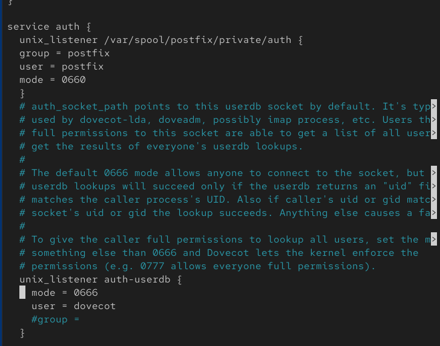{#fig:013}

Теперь настроим аутентификацию почты smtp для postfix и укажем, каким правилам следовать для работы с почтой и её фильтрации. Рассмотрим опции   

reject_unknown_recipient_domain - Отклонить письмо, если домен в адресе получателя не существует.   

permit_mynetworks - Разрешить письмо без дальнейших проверок, если IP-адрес клиента, отправляющего письмо, находится в списке доверенных сетей.   

reject_non_fqdn_recipient - Отклонить письмо, если адрес получателя не является полностью определённым доменным именем.   

reject_unauth_destination - отклоняет письмо, если домен получателя не является локальным для этого сервера и при этом сессия не аутентифицирована.   

reject_unverified_recipient - Отклонить письмо, если Postfix не может проверить существование получателя.   

permit - Если ни одно из предыдущих правил не отклонило и не разрешило письмо, это правило разрешает его.   
    
 (рис. [-@fig:014]).

{#fig:014}

Теперь отредактируем файл /etc/postfix/master.cf (рис. [-@fig:015]).

{#fig:015}

В этом файле внесём изменения так, чтобы smtp поддерживал авторизацию по sasl (рис. [-@fig:016]).

{#fig:016}

Теперь перезапустим postfix и dovecot (рис. [-@fig:017]).

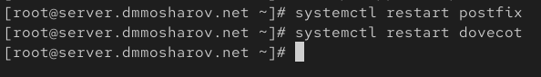{#fig:017}

Теперь на клиенте установим telnet (рис. [-@fig:018]).

{#fig:018}

Теперь получим ключ авторизации. Этот ключ представляет из себя строку, содержащую имя пользователя и пароль, и зашифрованную в base64. Теперь по telnet подключимся к почтовому серверу и проверим соединение. После этого попробуем с помощью команды auth авторизироваться, в качестве ключа используя нашу base64 строку. Как видим, авторизация прошла успешно (Authentification successful) (рис. [-@fig:019]).

{#fig:019}

Теперь настроим сертификаты для postfix, а также уровень security и путь к базе данных кэша (рис. [-@fig:020]).

{#fig:020}

Вновь откроем файл /etc/postfix/master.cf и изменим его следующим образом (рис. [-@fig:021]).

{#fig:021}

Теперь настроим firewall, разрешив использовать smtp-submission, и перезапустим postfix (рис. [-@fig:022]).

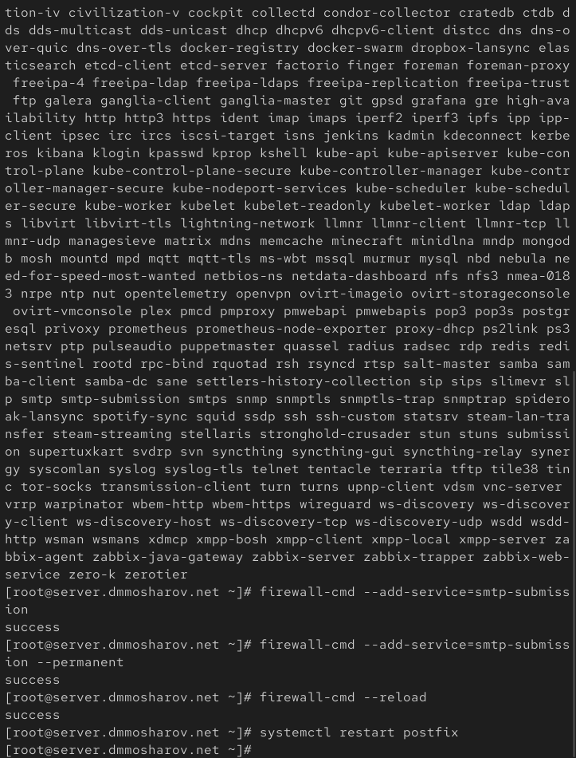{#fig:022}

Теперь подключимся к серверу через openssl (рис. [-@fig:023]).

{#fig:023}

И попробуем авторизоваться. Как видим, авторизация проходит успешно (рис. [-@fig:024]).

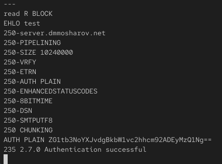{#fig:024}

Зайдём в почтовый клиент и поменяем порт для smtp на 587, и включим авторизацию. Кроме того, включим шифрование (рис. [-@fig:025]).

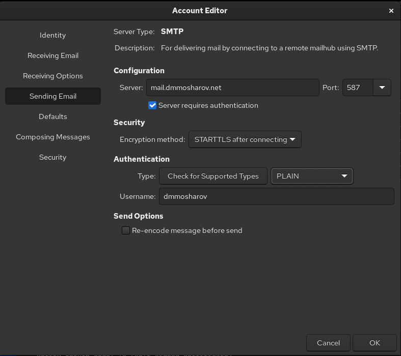{#fig:025}

Отправим себе же тестовое письмо (рис. [-@fig:026]).

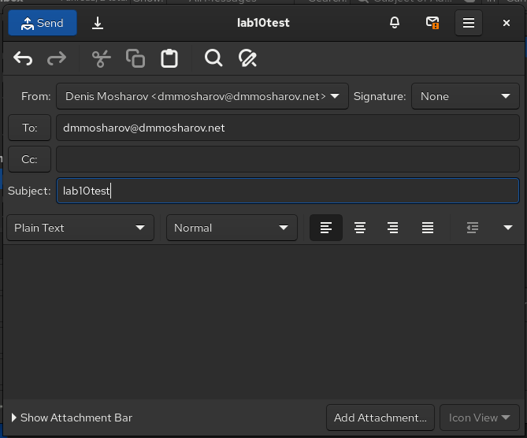{#fig:026}

Убедимся, что оно доставлено и лежит в ящике (рис. [-@fig:027]).

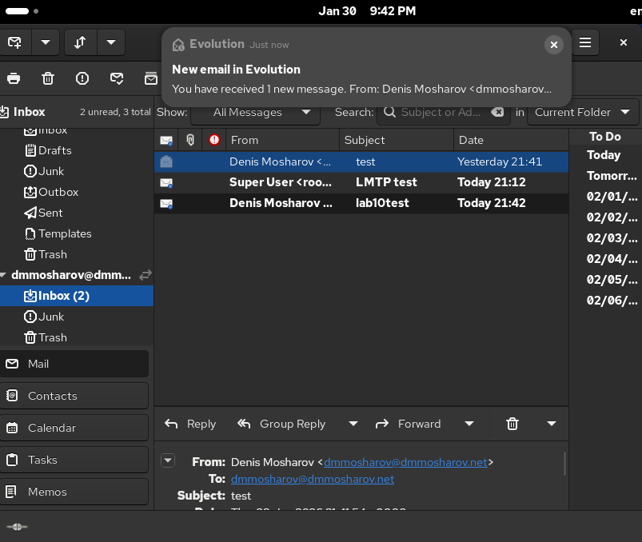{#fig:027}

На сервере в логах посмотрим, что мы действительно получили письмо (рис. [-@fig:028]).

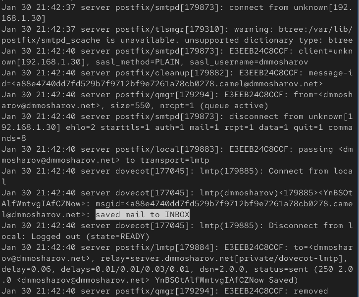{#fig:028}

Теперь сохраним внесённые нами изменения в vagrant (рис. [-@fig:029]).

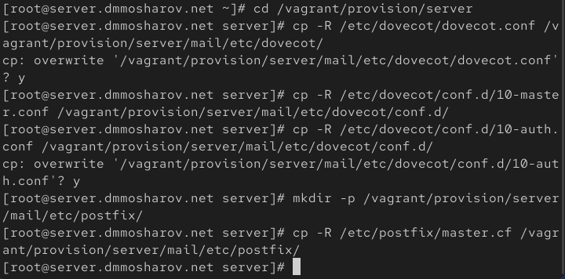{#fig:029}

На сервере изменим скрипт mail.sh следующим образом (рис. [-@fig:030]).

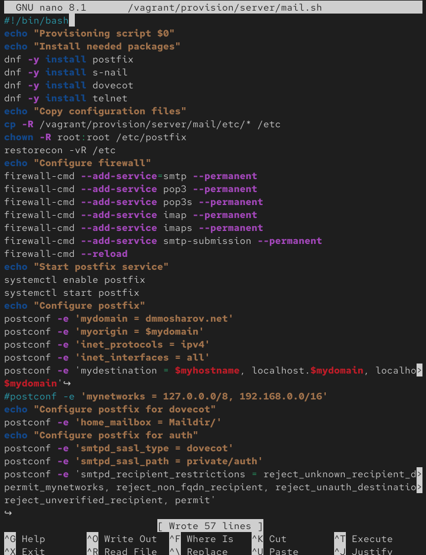{#fig:030}

Скрипт mail.sh для клиента мы тоже немного изменим, добавив установку telnet (рис. [-@fig:031]).

{#fig:031}

# Выводы

В результате выполнения лабораторной работы были получены навыки продвинутой настройки smtp и авторизации