---
## Front matter
title: "Отчёт о лабораторной работе"
subtitle: "Лабораторная работа 11"
author: "Мошаров Денис Максимович"

## Generic otions
lang: ru-RU
toc-title: "Содержание"

## Bibliography
bibliography: bib/cite.bib
csl: pandoc/csl/gost-r-7-0-5-2008-numeric.csl

## Pdf output format
toc: true # Table of contents
toc-depth: 2
lof: true # List of figures
lot: true # List of tables
fontsize: 12pt
linestretch: 1.5
papersize: a4
documentclass: scrreprt
## I18n polyglossia
polyglossia-lang:
  name: russian4
  options:
	- spelling=modern
	- babelshorthands=true
polyglossia-otherlangs:
  name: english
## I18n babel
babel-lang: russian
babel-otherlangs: english
## Fonts
mainfont: IBM Plex Serif
romanfont: IBM Plex Serif
sansfont: IBM Plex Sans
monofont: IBM Plex Mono
mathfont: STIX Two Math
mainfontoptions: Ligatures=Common,Ligatures=TeX,Scale=0.94
romanfontoptions: Ligatures=Common,Ligatures=TeX,Scale=0.94
sansfontoptions: Ligatures=Common,Ligatures=TeX,Scale=MatchLowercase,Scale=0.94
monofontoptions: Scale=MatchLowercase,Scale=0.94,FakeStretch=0.9
mathfontoptions:
## Biblatex
biblatex: true
biblio-style: "gost-numeric"
biblatexoptions:
  - parentracker=true
  - backend=biber
  - hyperref=auto
  - language=auto
  - autolang=other*
  - citestyle=gost-numeric
## Pandoc-crossref LaTeX customization
figureTitle: "Рис."
tableTitle: "Таблица"
listingTitle: "Листинг"
lofTitle: "Список иллюстраций"
lotTitle: "Список таблиц"
lolTitle: "Листинги"
## Misc options
indent: true
header-includes:
  - \usepackage{indentfirst}
  - \usepackage{float} # keep figures where there are in the text
  - \floatplacement{figure}{H} # keep figures where there are in the text
---

# Цель работы

Приобретение практических навыков по настройке удалённого доступа к серверу с помощью SSH.

# Выполнение лабораторной работы

Для начала зайдём на сервер и авторизуемся от рута, после чего сменим для него пароль (рис. [-@fig:001]).

{#fig:001}

Во втором терминале запустим вывод логов journalctl в реальном времени (рис. [-@fig:002]).

{#fig:002}

Далее, зайдём на клиент. С клиента попытаемся по ssh подключиться к серверу от имени учётной записи root. Операция успешна (рис. [-@fig:003]).

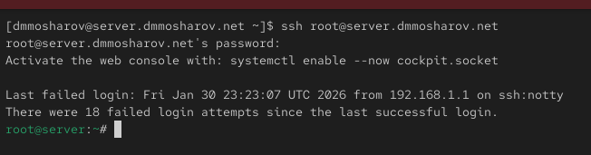{#fig:003}

Посмотрим логи и увидим, что авторизация была разрешена, и парол был принят (рис. [-@fig:004]).

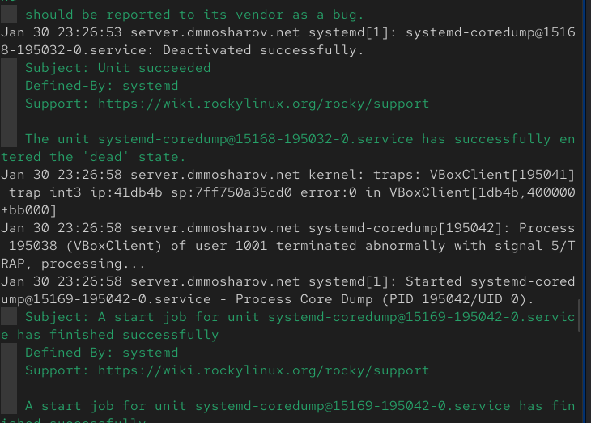{#fig:004}

Теперь откроем на сервере файл /etc/ssh/sshd_config и пропишем там PermitRootLogin как no, для запрета авторизации от имени рута (рис. [-@fig:005]).

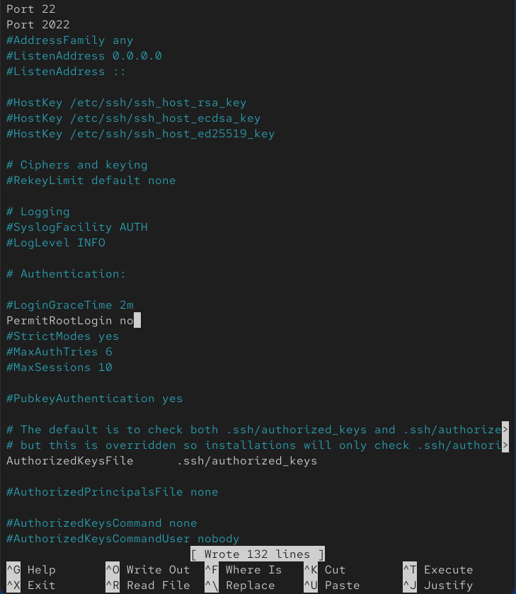{#fig:005}

Перезапустим теперь службу sshd на сервере (рис. [-@fig:006]).

{#fig:006}

Теперь на клиенте попробуем подключиться по ssh под пользователем root и увидим, что пароль неверный. Это не так, но это значит, что авторизация была запрещена (рис. [-@fig:007]).

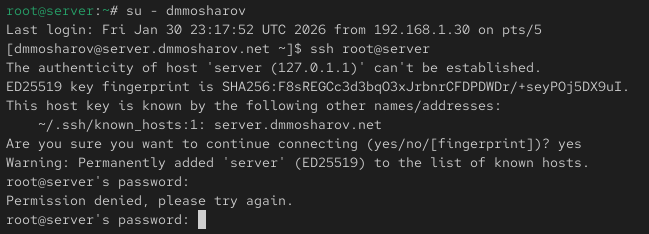{#fig:007}

В логах увидим, что авторизация провалена, и не удалось проверить пароль (рис. [-@fig:008]).

{#fig:008}

Попробуем подключиться по ssh к серверу от имени своей учётной записи. Как видим, авторизация успешна (рис. [-@fig:009]).

{#fig:009}

Теперь в файле конфигурации sshd пропишем список разрешённых пользователей для авторизации. Пока это будет 1 пользователь - vagrant (рис. [-@fig:010]).

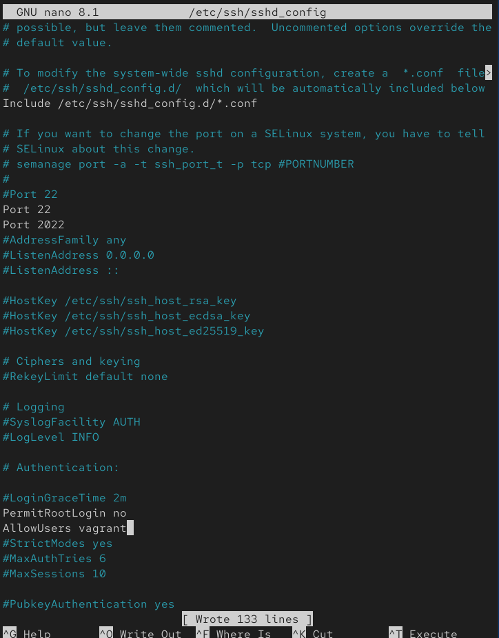{#fig:010}

Перезапустим sshd (рис. [-@fig:011]).

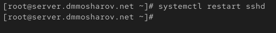{#fig:011}

Вновь на клиенте попробуем авторизаваться под пользователем. Но теперь операция авторизации была провалена, поскольку пользователя нет в белом списке, обозначенном на прошлом этапе (рис. [-@fig:012]).

{#fig:012}

Снова откроем файл конфигурации на сервере и добавим пользователя в белый список (рис. [-@fig:013]).

{#fig:013}

После перезапуска службы мы увидим, что подключение с клиента на сервер под учётной записью пользователя проходит успешно (рис. [-@fig:014]).

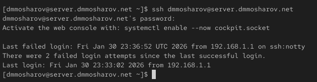{#fig:014}

Теперь в файле конфигурации на сервере добавим рабочие порты 22 и 2022 (рис. [-@fig:015]).

{#fig:015}

Теперь с клиента попробуем подключиться к серверу по ssh, используя добавленные нами порты. Как видим, оба подключения прошли успешно (рис. [-@fig:019]).

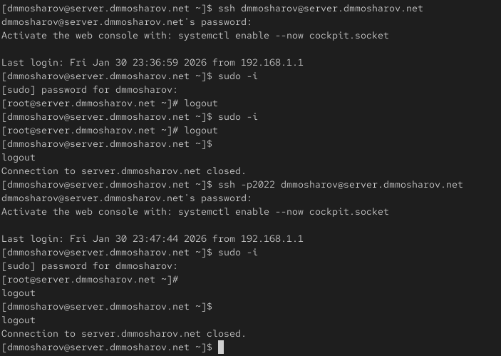{#fig:019}

Вновь откроем файл конфигурации и разрешим авторизацию по ключу (рис. [-@fig:020]).

{#fig:020}

Перезапустим sshd (рис. [-@fig:021]).

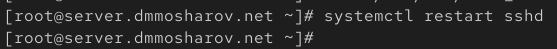{#fig:021}

Теперь на клиенте сгенерируем rsa ключ и отправим его на сервер (рис. [-@fig:022]).

{#fig:022}

Теперь попробуем подключиться к серверу по ssh, и на этот раз у нас не спросят пароль (рис. [-@fig:023]).

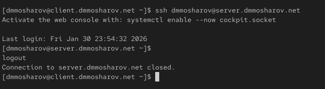{#fig:023}

Теперь выведем список служб, использующих TCP (рис. [-@fig:024]).

{#fig:024}

Теперь перенаправим порт 8080 на server.nsandryushin.net на 80 порт локалхоста (рис. [-@fig:025]).

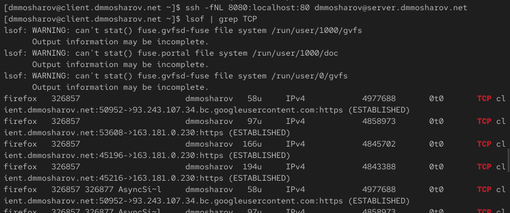{#fig:025}

Теперь, обращаясь к localhost:8080 мы видим наш сайт по адресу server.nsandryushin.net:80 (рис. [-@fig:027]).

{#fig:027}

На клиенте теперь попробуем вызвать несколько консольных утилит через ssh на сервере, а именно вывод имени хоста, вывод содержимого домашнего каталога и вывод почты (рис. [-@fig:028]).

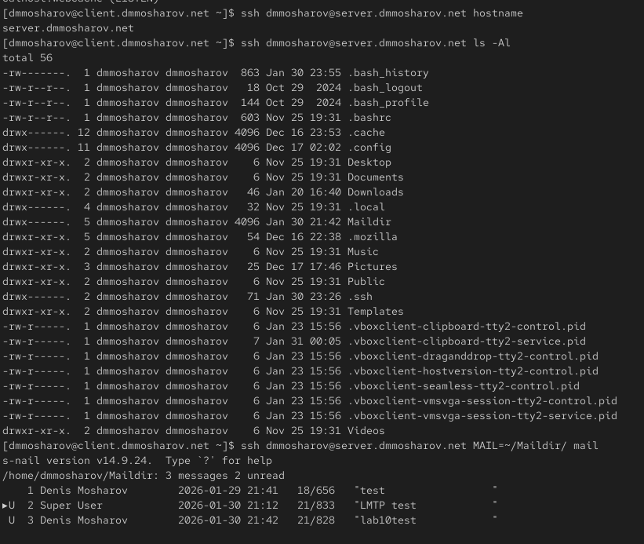{#fig:028}

В конфигурационном файле sshd на сервере включим форвардинг X11 (рис. [-@fig:029]).

{#fig:029}

Перезапустим sshd (рис. [-@fig:030]).

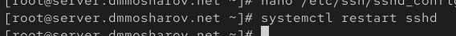{#fig:030}

И запустим графическое приложение, например firefox, по ssh (рис. [-@fig:031]).

{#fig:031}

Как видим, на сервере запустился firefox (рис. [-@fig:032]).

{#fig:032}

Теперь сохраним файлы, с которыми велась работа, в vagrant (рис. [-@fig:033]).

{#fig:033}

Создадим скрипт ssh.sh и наполним его следующим содержимым (рис. [-@fig:034]).

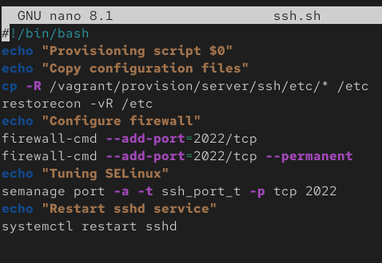{#fig:034}

И добавим этот скрипт в vagrantfile (рис. [-@fig:035]).

{#fig:035}

# Выводы

В результате выполнения лабораторной работы были получены навыки настройки ssh, форвардинга через него и настройки авторизации