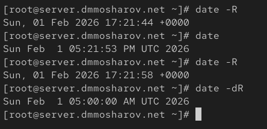
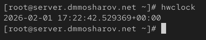
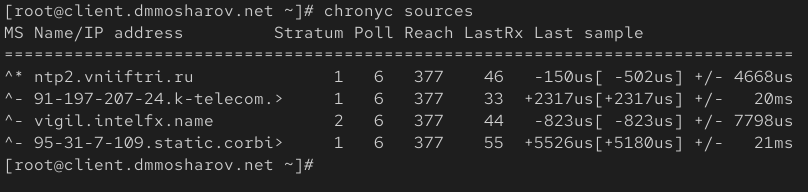
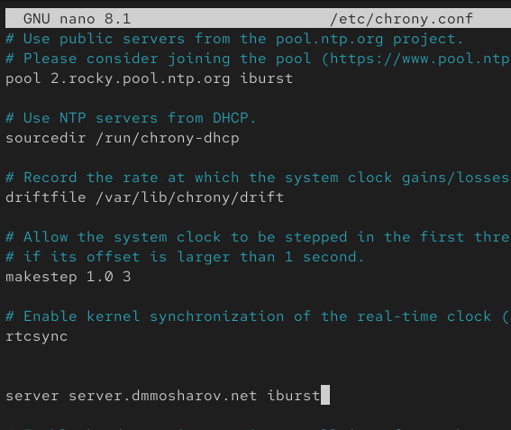
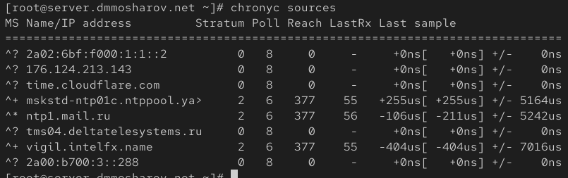
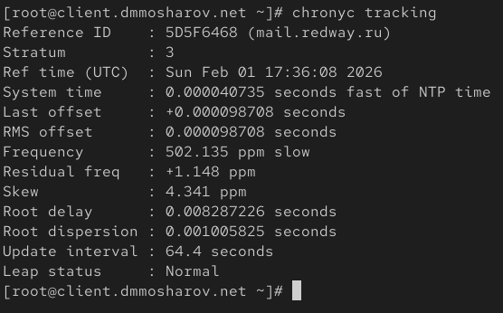
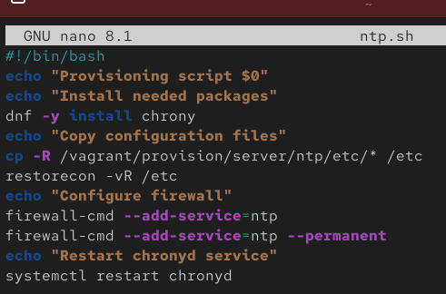
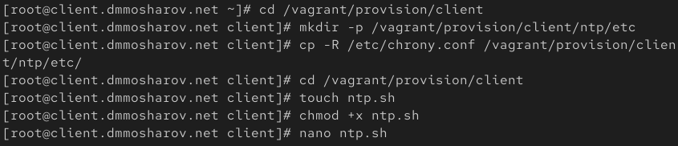
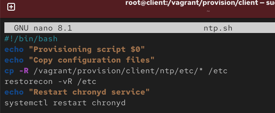
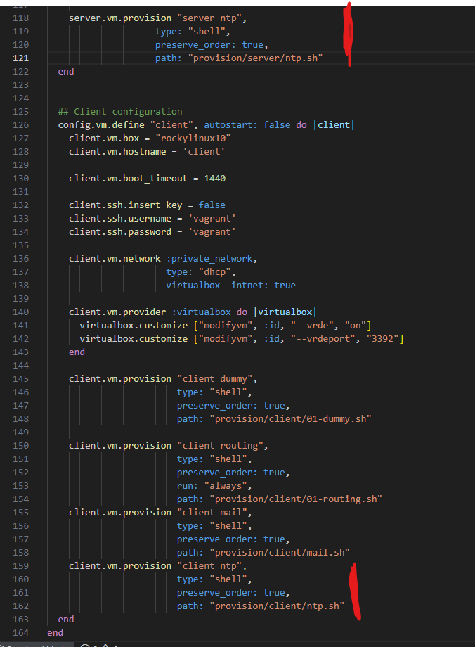

---
## Front matter
title: "Отчёт о лабораторной работе"
subtitle: "Лабораторная работа 12"
author: "Мошаров Денис Максимович"

## Generic otions
lang: ru-RU
toc-title: "Содержание"

## Bibliography
bibliography: bib/cite.bib
csl: pandoc/csl/gost-r-7-0-5-2008-numeric.csl

## Pdf output format
toc: true # Table of contents
toc-depth: 2
lof: true # List of figures
lot: true # List of tables
fontsize: 12pt
linestretch: 1.5
papersize: a4
documentclass: scrreprt
## I18n polyglossia
polyglossia-lang:
  name: russian4
  options:
	- spelling=modern
	- babelshorthands=true
polyglossia-otherlangs:
  name: english
## I18n babel
babel-lang: russian
babel-otherlangs: english
## Fonts
mainfont: IBM Plex Serif
romanfont: IBM Plex Serif
sansfont: IBM Plex Sans
monofont: IBM Plex Mono
mathfont: STIX Two Math
mainfontoptions: Ligatures=Common,Ligatures=TeX,Scale=0.94
romanfontoptions: Ligatures=Common,Ligatures=TeX,Scale=0.94
sansfontoptions: Ligatures=Common,Ligatures=TeX,Scale=MatchLowercase,Scale=0.94
monofontoptions: Scale=MatchLowercase,Scale=0.94,FakeStretch=0.9
mathfontoptions:
## Biblatex
biblatex: true
biblio-style: "gost-numeric"
biblatexoptions:
  - parentracker=true
  - backend=biber
  - hyperref=auto
  - language=auto
  - autolang=other*
  - citestyle=gost-numeric
## Pandoc-crossref LaTeX customization
figureTitle: "Рис."
tableTitle: "Таблица"
listingTitle: "Листинг"
lofTitle: "Список иллюстраций"
lotTitle: "Список таблиц"
lolTitle: "Листинги"
## Misc options
indent: true
header-includes:
  - \usepackage{indentfirst}
  - \usepackage{float} # keep figures where there are in the text
  - \floatplacement{figure}{H} # keep figures where there are in the text
---

# Цель работы

Получение навыков по управлению системным временем и настройке синхронизации времени

# Выполнение лабораторной работы

На сервере посмотрим текущие параметры настройки даты и времени с помощью утилиты timedatectl. Было определено, что сервер находится во временной зоне UTC, системные часы синхронизированы, а служба NTP активна (рис. [-@fig:001]).

{#fig:001}

Далее проведём эксперименты с параметрами команды timedatectl. В частности, используем параметр show для вывода подробного списка свойств конфигурации времени (рис. [-@fig:002]).

{#fig:002}

Аналогичную проверку параметров времени выполним на клиентской машине. Клиент также находится в зоне UTC, и сетевая синхронизация времени активна (рис. [-@fig:003]).

{#fig:003}	

На сервере проверим текущее системное время с помощью команды date. Проведём эксперименты с ключами команды, например, вывод даты в формате RFC 2822 с помощью ключа -R (рис. [-@fig:004]).

{#fig:004}

На клиенте также просмотрим текущее системное время (рис. [-@fig:005]).

{#fig:005}

Затем на сервере проверим аппаратное время (RTC) с помощью утилиты hwclock (рис. [-@fig:006]).

{#fig:006}

Аналогичным образом аппаратное время проверим на клиентской машине (рис. [-@fig:007]).

{#fig:007}

Проверим источники точного времени на сервере с помощью команды chronyc sources. Видно, что сервер синхронизируется с внешними источниками (рис. [-@fig:008]).

{#fig:008}

Проверим источники точного времени на клиентской машине. На данном этапе клиент также использует внешние пулы для синхронизации (рис. [-@fig:009]).

{#fig:009}

Отредактируем конфигурационный файл /etc/chrony.conf на сервере. Добавим директиву allow 192.168.0.0/16, разрешающую клиентам из локальной сети запрашивать точное время (рис. [-@fig:010]).

{#fig:010}

Перезапустим службу синхронизации времени chronyd для применения изменений конфигурации, а также добавим службу ntp в исключения фаервола на сервере для входящих подключений (рис. [-@fig:011]).

{#fig:011}

Отредактируем конфигурационный файл /etc/chrony.conf на клиенте. Укажем локальный сервер server.dmmosharov.net в качестве источника времени с параметром iburst для ускоренной начальной синхронизации (рис. [-@fig:012]).

{#fig:012}

Перезапустим службу chronyd на клиентской машине для вступления настроек в силу (рис. [-@fig:013]).

{#fig:013}

Вновь проверим источники синхронизации на сервере. Вывод подтверждает наличие активных соединений с внешними эталонными серверами (рис. [-@fig:014]).

{#fig:014}

Далее проверим источники времени на клиентской машине после настройки конфигурации. Команда chronyc sources показывает список серверов. В выводе видно, что настроенный нами server.dmmosharov.net (помечен символом +) распознан как кандидат на синхронизацию, имеющий Stratum 3, что подтверждает корректность настройки DNS и доступность сервера (рис. [-@fig:015]).

{#fig:015}

Для получения более детальной информации о процессе синхронизации на сервере используем команду chronyc tracking. Вывод содержит информацию о Reference ID (вышестоящем сервере), текущем стратуме (Stratum 3), а также о частоте и задержках (рис. [-@fig:016]).

{#fig:016}

Внесём изменения в вагрант и создадим скрипт ntp.sh (рис. [-@fig:017]).

{#fig:017}

Добавим следующие изменения в файл ntp.sh (рис. [-@fig:018]).

{#fig:018}

Аналогичные действия по подготовке окружения выполним на виртуальной машине client. Создадим исполняемый файл ntp.sh (рис. [-@fig:019]).

{#fig:019}

Добавим следующие изменения в файл ntp.sh (рис. [-@fig:020]).

{#fig:020}

Внесём изменения в vagrantfile (рис. [-@fig:021]).

{#fig:021}

# Выводы

В результате выполнения лабораторной работы были получены навыки настройки системного времени и ntp синхронизации