---
## Front matter
title: "Отчёт о лабораторной работе"
subtitle: "Лабораторная работа 13"
author: "Мошаров Денис Максимович"

## Generic otions
lang: ru-RU
toc-title: "Содержание"

## Bibliography
bibliography: bib/cite.bib
csl: pandoc/csl/gost-r-7-0-5-2008-numeric.csl

## Pdf output format
toc: true # Table of contents
toc-depth: 2
lof: true # List of figures
lot: true # List of tables
fontsize: 12pt
linestretch: 1.5
papersize: a4
documentclass: scrreprt
## I18n polyglossia
polyglossia-lang:
  name: russian4
  options:
	- spelling=modern
	- babelshorthands=true
polyglossia-otherlangs:
  name: english
## I18n babel
babel-lang: russian
babel-otherlangs: english
## Fonts
mainfont: IBM Plex Serif
romanfont: IBM Plex Serif
sansfont: IBM Plex Sans
monofont: IBM Plex Mono
mathfont: STIX Two Math
mainfontoptions: Ligatures=Common,Ligatures=TeX,Scale=0.94
romanfontoptions: Ligatures=Common,Ligatures=TeX,Scale=0.94
sansfontoptions: Ligatures=Common,Ligatures=TeX,Scale=MatchLowercase,Scale=0.94
monofontoptions: Scale=MatchLowercase,Scale=0.94,FakeStretch=0.9
mathfontoptions:
## Biblatex
biblatex: true
biblio-style: "gost-numeric"
biblatexoptions:
  - parentracker=true
  - backend=biber
  - hyperref=auto
  - language=auto
  - autolang=other*
  - citestyle=gost-numeric
## Pandoc-crossref LaTeX customization
figureTitle: "Рис."
tableTitle: "Таблица"
listingTitle: "Листинг"
lofTitle: "Список иллюстраций"
lotTitle: "Список таблиц"
lolTitle: "Листинги"
## Misc options
indent: true
header-includes:
  - \usepackage{indentfirst}
  - \usepackage{float} # keep figures where there are in the text
  - \floatplacement{figure}{H} # keep figures where there are in the text
---

# Цель работы

Приобретение навыков настройки сервера NFS для удалённого доступа к ресурсам

# Выполнение лабораторной работы

Установим на сервере пакет nfs-utils, необходимый для работы NFS (рис. [-@fig:001]).

{#fig:001}

Создим каталог /srv/nfs, который будет использоваться как общий ресурс, и открываем файл конфигурации экспорта /etc/exports (рис. [-@fig:002]).

{#fig:002}

В файле /etc/exports прописываем настройки для созданного каталога, разрешая доступ к нему всем узлам (*) только на чтение (ro) (рис. [-@fig:003]).

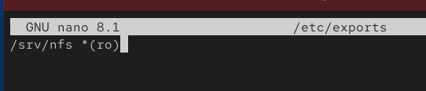{#fig:003}

Применим контекст безопасности SELinux nfs_t к каталогу, запускаем и добавляем в автозагрузку службу NFS-сервера, а также открываем порт для службы nfs в межсетевом экране (рис. [-@fig:004]).

{#fig:004}

На клиентской виртуальной машине также устанавливаем пакет nfs-utils, необходимый для монтирования удаленных ресурсов (рис. [-@fig:005]).

{#fig:005}

На клиенте была выполнена попытка просмотра доступных удаленных ресурсов с помощью команды showmount -e. В результате было получено сообщение об ошибке clnt_create: RPC: Unable to receive, что свидетельствует о невозможности установить соединение со службой RPC на сервере, вероятно, из-за блокировки сетевым экраном (рис. [-@fig:006]).

{#fig:006}

Для диагностики проблемы и проверки влияния межсетевого экрана на сервере была временно остановлена служба firewalld (рис. [-@fig:007]).

{#fig:007}

После отключения фаервола на сервере, повторная проверка доступных ресурсов на клиенте прошла успешно. Команда отобразила экспортируемый каталог /srv/nfs, что подтверждает блокировку необходимых портов межсетевым экраном при его активной работе (рис. [-@fig:008]).

{#fig:008}

Далее на сервере работа межсетевого экрана была восстановлена. Для определения служб и портов, задействованных при работе NFS, выполним команду lsof с фильтрацией по протоколу TCP (рис. [-@fig:009]).

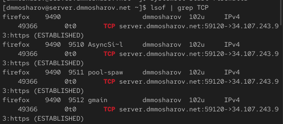{#fig:009}

Вывод команды показывает наличие активных служб rpcbind и rpc.mountd. Это указывает на то, что для корректной работы NFS через фаервол необходимо разрешить доступ не только к службе nfs, но и к mountd и rpc-bind (рис. [-@fig:010]).

{#fig:010}

На сервере выполняется команда sudo lsof | grep UDP, позволяющая определить, какие процессы используют UDP‑сокеты; в выводе видны службы systemd, avahi-daemon, chronyd, named и другие, что используется для анализа сетевых сервисов, задействованных при работе NFS (рис. [-@fig:011]).

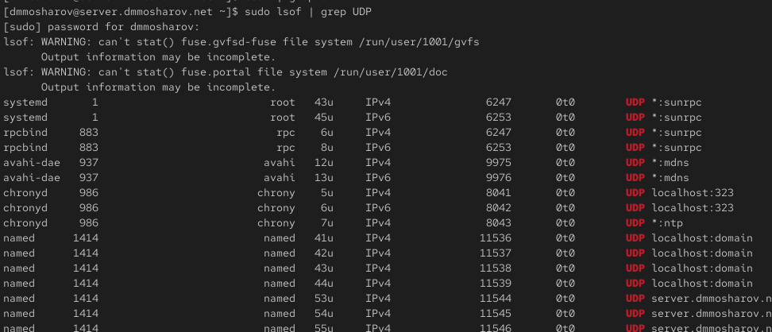{#fig:011}

Продолжение вывода команды sudo lsof | grep UDP на сервере; среди задействованных UDP‑служб отображаются процессы rpcbind, rpc.statd и rpc.mountd, относящиеся к подсистеме RPC и участвующие в работе NFS‑сервера, поэтому именно их порты необходимо открыть в межсетевом экране (рис. [-@fig:012]).

{#fig:012}

На сервере с помощью firewall-cmd --get-services просматриваем список предопределённых сетевых служб в firewalld, после чего выполняем команды firewall-cmd --add-service=mountd --add-service=rpc-bind и аналогичную команду с опцией --permanent, открывающие доступ к службам mountd и rpc-bind как в текущей, так и в постоянной конфигурации брандмауэра, затем конфигурация межсетевого экрана перезагружается командой firewall-cmd --reload (рис. [-@fig:013]).

{#fig:013}

На клиентской машине выполняем команду sudo showmount -e server.dmmosharov.net, запрашивающую у NFS‑сервера список экспортируемых каталогов; в ответ отображается экспорт /srv/nfs для всех клиентов (*), что подтверждает доступность NFS‑сервера через настроенный межсетевой экран (рис. [-@fig:014]).

{#fig:014}

На клиенте создаём каталог /mnt/nfs, после чего выполняем монтирование экспортируемого с сервера каталога server.dmmosharov.net:/srv/nfs в эту точку командой sudo mount; затем команда mount без параметров выводит список всех смонтированных файловых систем, в котором присутствует запись о подключённом ресурсе типа nfs4 с указанными параметрами монтирования, что подтверждает успешное подключение удалённого раздела (рис. [-@fig:015]).

{#fig:015}

Для настройки автоматического монтирования удаленного ресурса при запуске операционной системы отредактируем файл /etc/fstab на клиенте. В конец файла была добавлена запись server.dmmosharov.net:/srv/nfs /mnt/nfs nfs _netdev 0 0. Опция _netdev здесь указывает системе, что монтирование зависит от наличия сети, и предотвращает попытки монтирования до поднятия сетевых интерфейсов (рис. [-@fig:016]).

{#fig:016}

После сохранения изменений проверим статус службы, отвечающей за монтирование удаленных файловых систем. Команда systemctl status remote-fs.target показала, что цель (target) активна и загружена, что означает готовность системы к автоматическому монтированию сетевых ресурсов (рис. [-@fig:017]).

{#fig:017}

После перезагрузки клиента убедимся, что ресурс действительно подключен. Команда mount выводит список всех точек монтирования. В выводе присутствует строка, подтверждающая, что ресурс server.dmmosharov.net:/srv/nfs смонтирован в /mnt/nfs с типом файловой системы nfs4 (версия 4.2) и правами rw (чтение и запись), что соответствует успешному выполнению настройки (рис. [-@fig:018]).

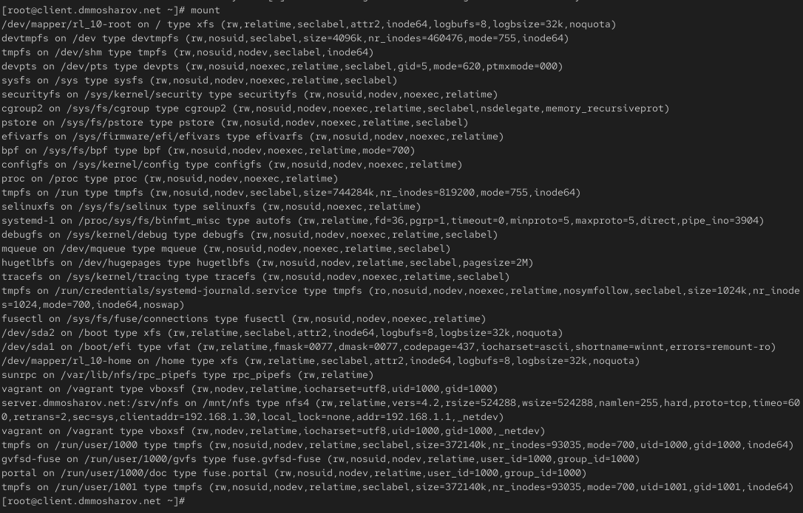{#fig:018}

Далее перейдём к выполнению задания по подключению каталога с контентом веб-сервера к дереву NFS. На сервере создадим каталог /srv/nfs/www и выполним bind-монтирование реального каталога веб-сервера /var/www/ в созданную директорию с помощью команды mount -o bind. Это позволяет сделать содержимое /var/www доступным внутри структуры NFS, не перемещая сами файлы (рис. [-@fig:019]).

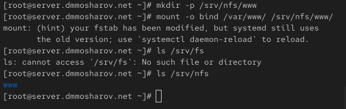{#fig:019}

После выполнения монтирования на сервере, вернёмся на клиентскую машину и проверим содержимое смонтированного каталога /mnt/nfs. Команда ls показала наличие директории www, что подтверждает корректное отображение структуры каталогов сервера на клиенте через NFS (рис. [-@fig:020]).

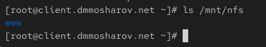{#fig:020}

На сервере в файл /etc/exports добавляем запись для экспорта каталога веб-сервера. Указываем путь /srv/nfs/www и разрешаем доступ для подсети 192.168.0.0/16 с правами на чтение и запись (rw) (рис. [-@fig:021]).

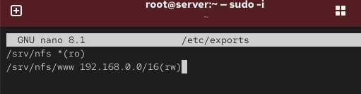{#fig:021}

Применяем изменения и экспортируем указанные каталоги с помощью утилиты exportfs с флагом -r (рис. [-@fig:022]).

{#fig:022}

На клиентской машине проверяем содержимое смонтированного ресурса /mnt/nfs. Убеждаемся, что каталог www теперь отображается и доступен (рис. [-@fig:023]).

{#fig:023}

Для того чтобы привязка (bind) каталога /var/www к /srv/nfs/www сохранялась после перезагрузки, добавляем соответствующую строку конфигурации в конец файла /etc/fstab на сервере (рис. [-@fig:024]).

{#fig:024}

После настройки автоматического монтирования повторно выполняем команду exportfs -r на сервере для обновления таблицы экспорта (рис. [-@fig:025]).

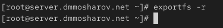{#fig:025}

Проверяем содержимое примонтированных каталогов на клиентской машине. В каталоге /mnt/nfs/ успешно отображается директория www, содержащая контент веб-сервера (рис. [-@fig:026]).

{#fig:026}

На сервере создаём рабочий каталог common в домашней директории пользователя и создаём в нём тестовый файл. Затем создаём соответствующую директорию в дереве NFS (/srv/nfs/home/dmmosharov) и выполняем монтирование методом bind для объединения этих каталогов (рис. [-@fig:027]).

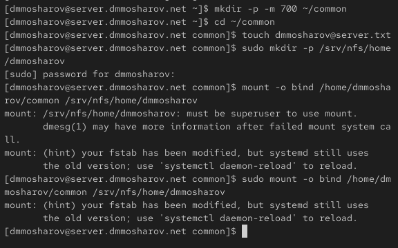{#fig:027}

Редактируем файл конфигурации /etc/exports на сервере. Добавляем запись для экспорта домашнего каталога пользователя с правами на чтение и запись для локальной сети (рис. [-@fig:028]).

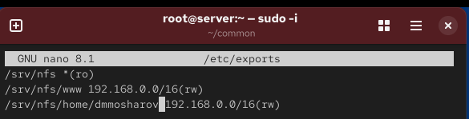{#fig:028}

Для сохранения настроек монтирования после перезагрузки сервера вношу изменения в файл /etc/fstab. Добавляю записи для bind-монтирования каталогов /var/www и /home/dmmosharov/common в соответствующие точки монтирования дерева NFS (рис. [-@fig:029]).

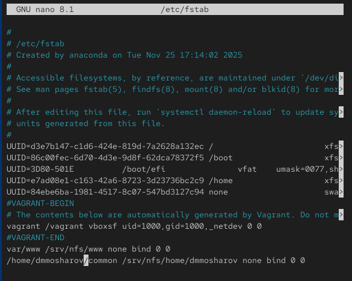{#fig:029}

После обновления таблицы экспорта на сервере (exportfs -r) перехожу на клиентскую машину и проверяю содержимое /mnt/nfs/. Вижу, что появилась директория home, а в ней — каталог пользователя dmmosharov (рис. [-@fig:030]).

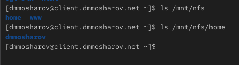{#fig:030}

На клиенте в каталоге /mnt/nfs/home/dmmosharov создадим файл dmmosharov@client.txt с произвольным содержимым. При попытке выполнить действия в этом каталоге от имени суперпользователя получен отказ в доступе (Permission denied), что свидетельствует о корректной работе настройки безопасности NFS, которая по умолчанию запрещает удаленному root-пользователю иметь привилегии root на файловой системе сервера (рис. [-@fig:031]).

{#fig:031}

На сервере проверим наличие созданного на клиенте файла. Файл dmmosharov@client.txt успешно отображается в каталоге /home/dmmosharov/common, содержимое файла совпадает с тем, что было записано на клиенте (рис. [-@fig:032]).

{#fig:032}

Далее выполним настройку provision. На сервере в каталоге /vagrant/provision/server создадим необходимую структуру каталогов, скопируем файл конфигурации /etc/exports и создадим исполняемый файл скрипта nfs.sh (рис. [-@fig:033]).

{#fig:033}

В файл nfs.sh на сервере запишем скрипт, автоматизирующий все ранее выполненные действия: установку пакетов, копирование конфигурационных файлов, настройку межсетевого экрана и SELinux, создание каталогов, bind-монтирование и запуск служб (рис. [-@fig:034]).

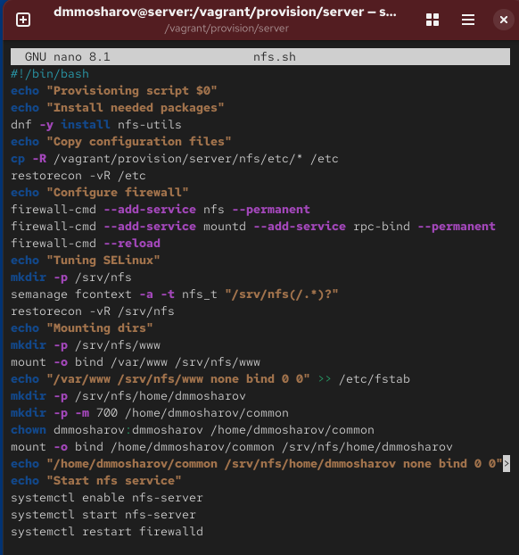{#fig:034}

Аналогичные действия выполним для клиентской машины. В каталоге /vagrant/provision/client создадим и сделаем исполняемым файл скрипта настройки nfs.sh (рис. [-@fig:035]).

{#fig:035}

Открываем его на редактирование и прописываем скрипт, который устанавливает необходимый пакет nfs-utils, создает каталог /mnt/nfs, монтирует удаленный ресурс и добавляет соответствующую запись в /etc/fstab для автоматического монтирования (рис. [-@fig:036]).

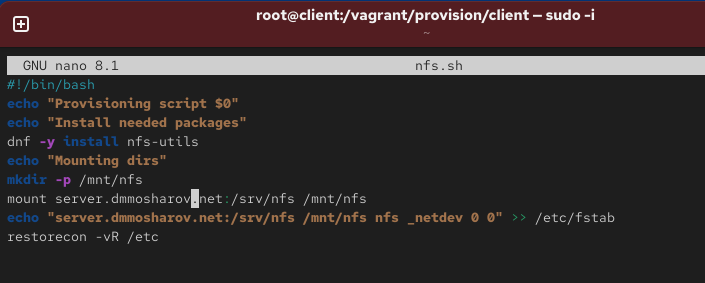{#fig:036}

Для автоматического запуска созданных скриптов во время загрузки виртуальных машин необходимо внести изменения в основной конфигурационный файл Vagrantfile. В соответствующие разделы конфигураций для сервера и клиента добавляем инструкции vm.provision для запуска файлов nfs.sh (рис. [-@fig:037]).

{#fig:037}

# Выводы

В результате выполнения лабораторной работы были получены навыки работы с nfs и сетевыми хранилищами, а так же их настройка