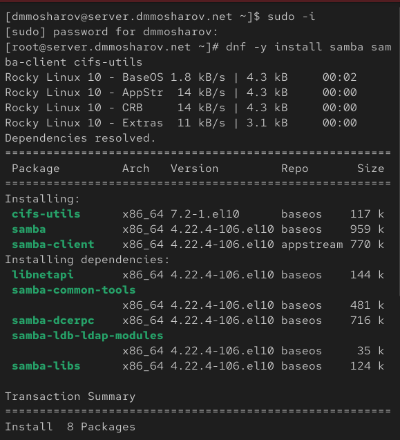
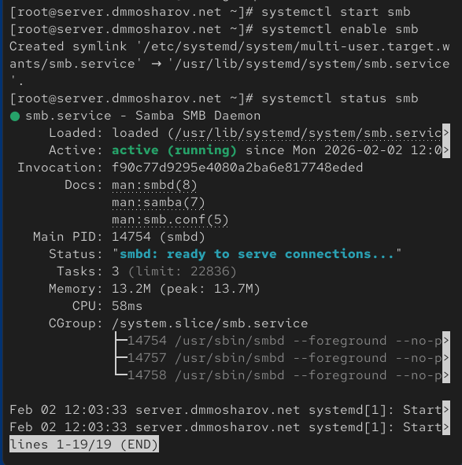
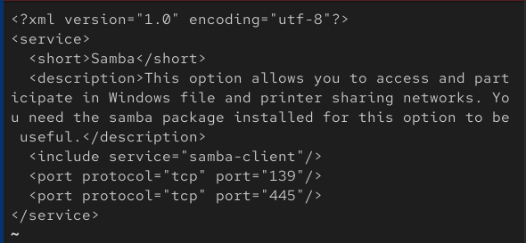
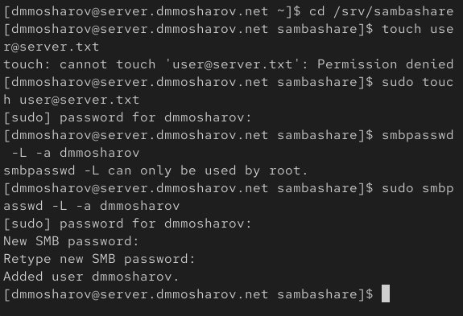
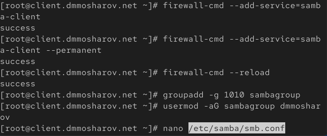
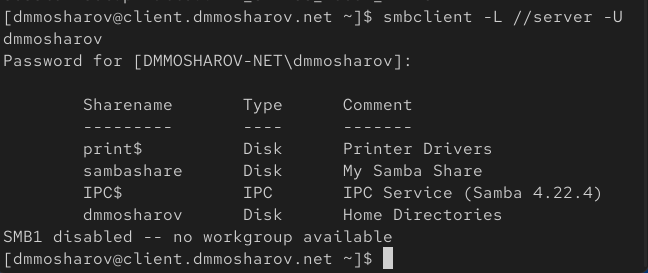
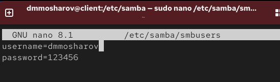
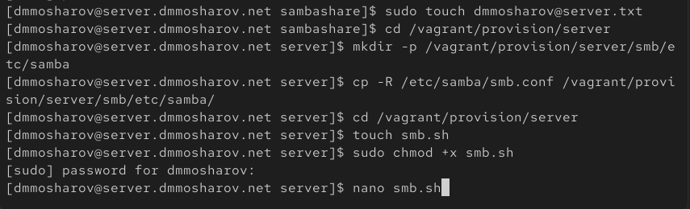
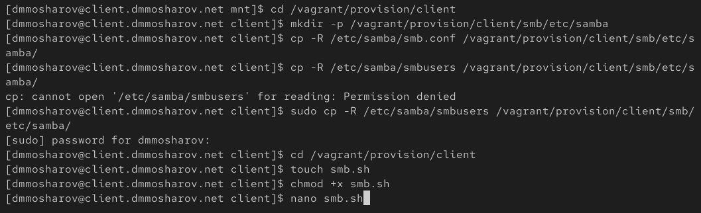

---
## Front matter
title: "Отчёт о лабораторной работе"
subtitle: "Лабораторная работа 14"
author: "Мошаров Денис Максимович"

## Generic otions
lang: ru-RU
toc-title: "Содержание"

## Bibliography
bibliography: bib/cite.bib
csl: pandoc/csl/gost-r-7-0-5-2008-numeric.csl

## Pdf output format
toc: true # Table of contents
toc-depth: 2
lof: true # List of figures
lot: true # List of tables
fontsize: 12pt
linestretch: 1.5
papersize: a4
documentclass: scrreprt
## I18n polyglossia
polyglossia-lang:
  name: russian4
  options:
	- spelling=modern
	- babelshorthands=true
polyglossia-otherlangs:
  name: english
## I18n babel
babel-lang: russian
babel-otherlangs: english
## Fonts
mainfont: IBM Plex Serif
romanfont: IBM Plex Serif
sansfont: IBM Plex Sans
monofont: IBM Plex Mono
mathfont: STIX Two Math
mainfontoptions: Ligatures=Common,Ligatures=TeX,Scale=0.94
romanfontoptions: Ligatures=Common,Ligatures=TeX,Scale=0.94
sansfontoptions: Ligatures=Common,Ligatures=TeX,Scale=MatchLowercase,Scale=0.94
monofontoptions: Scale=MatchLowercase,Scale=0.94,FakeStretch=0.9
mathfontoptions:
## Biblatex
biblatex: true
biblio-style: "gost-numeric"
biblatexoptions:
  - parentracker=true
  - backend=biber
  - hyperref=auto
  - language=auto
  - autolang=other*
  - citestyle=gost-numeric
## Pandoc-crossref LaTeX customization
figureTitle: "Рис."
tableTitle: "Таблица"
listingTitle: "Листинг"
lofTitle: "Список иллюстраций"
lotTitle: "Список таблиц"
lolTitle: "Листинги"
## Misc options
indent: true
header-includes:
  - \usepackage{indentfirst}
  - \usepackage{float} # keep figures where there are in the text
  - \floatplacement{figure}{H} # keep figures where there are in the text
---

# Цель работы

Приобретение навыков настройки доступа групп пользователей к общим ресурсам по протоколу SMB.

# Выполнение лабораторной работы

В начале работы мы подключаемся к серверу и выполняем установку необходимых пакетов. С помощью пакетного менеджера dnf мы инсталлируем samba (сам сервер), samba-client (клиентская утилита для проверки) и cifs-utils (утилиты для работы с файловой системой CIFS/SMB) (рис. [-@fig:001]).

{#fig:001}

Далее мы переходим к созданию пользователей и групп, которые будут использоваться для доступа к ресурсам. Мы создаем группу sambagroup с идентификатором GID 1010 и добавляем в неё нашего текущего пользователя. Также мы создаем директорию /srv/sambashare, которая станет общим ресурсом, и открываем файл конфигурации для редактирования (рис. [-@fig:002]).

{#fig:002}

В открытом файле конфигурации /etc/samba/smb.conf мы вносим изменения в раздел global, задавая имя рабочей группы dmmosharov-NET. В конце файла мы добавляем новую секцию sambashare, в которой описываем путь к каталогу, комментарий и список пользователей, имеющих право на запись (рис. [-@fig:003]).

{#fig:003}

Мы запускаем утилиту testparm, которая считывает конфиг, подтверждает, что сервисные файлы загружены корректно (Loaded services file OK), и выводит итоговые параметры секций (рис. [-@fig:004]).

{#fig:004}

Убедившись в правильности настроек, мы запускаем службу smb командой systemctl start. Затем мы добавляем её в автозагрузку (enable), чтобы сервис поднимался после перезагрузки, и проверяем статус, чтобы удостовериться, что служба активна (active (running)) (рис. [-@fig:005]).

{#fig:005}

Теперь проверим доступность ресурсов локально на сервере. Используя команду smbclient -L //server, мы подключаемся (в данном случае анонимно) и видим список доступных ресурсов, среди которых присутствует наш sambashare. После этого мы готовимся к настройке файрвола, просматривая расположение XML-файла сервиса (рис. [-@fig:006]).

{#fig:006}

Мы открываем файл описания сервиса /usr/lib/firewalld/services/samba.xml, чтобы понять, какие порты будут открыты. В файле указано, что сервис предназначен для доступа к файлам и принтерам Windows, и перечислены необходимые порты (TCP 139, 445 и связанные с netbios) (рис. [-@fig:007]).

{#fig:007}

Настраиваем межсетевой экран firewalld: добавляем сервис samba в текущую конфигурацию и в постоянную (--permanent), после чего перезагружаем правила. Также мы меняем группу-владельца каталога /srv/sambashare на sambagroup и устанавливаем полные права для группы. В конце проверяем текущий контекст безопасности SELinux (рис. [-@fig:008]).

{#fig:008}

Так как стандартный контекст безопасности не подходит для Samba, мы используем semanage fcontext для назначения типа samba_share_t нашему каталогу. После этого применяем изменения командой restorecon -vR. Повторная проверка ls -Z подтверждает, что контекст успешно изменился на samba_share_t (рис. [-@fig:009]).

{#fig:009}

Для корректной работы SELinux с Samba нам также необходимо включить соответствующий переключатель (boolean). Мы выполняем команду setsebool samba_export_all_rw 1 с флагом -P для сохранения настройки. Также проверяем идентификаторы нашего пользователя, чтобы убедиться, что он состоит в нужной группе (рис. [-@fig:010]).

{#fig:010}

Проверяем права на запись в каталог, создавая пустой файл user@server.txt. Затем выполняем важный шаг: добавляем нашего пользователя в базу данных пользователей Samba с помощью команды smbpasswd -a. Мы задаем пароль, который будет использоваться при сетевом подключении к ресурсу (рис. [-@fig:011]).

{#fig:011}

Настройка сервера завершена, переходим к клиентской машине. Первым делом устанавливаем пакеты, необходимые для подключения к общим ресурсам: samba-client и cifs-utils. Менеджер пакетов разрешает зависимости и успешно устанавливает программное обеспечение (рис. [-@fig:012]).

{#fig:012}

Аналогично серверу, мы изучаем конфигурацию файрвола для клиента. Просматриваем файл /usr/lib/firewalld/services/samba-client.xml. Это позволяет убедиться, что мы открываем правильные порты (в частности, UDP 137 и 138) для работы клиентской части протокола NetBIOS (рис. [-@fig:013]).

{#fig:013}

Настраиваем межсетевой экран на клиенте, разрешая сервис samba-client и перезагружая правила. Затем повторяем настройку окружения: создаем группу sambagroup с тем же GID 1010 и добавляем в неё пользователя. Открываем конфиг Samba для правки (рис. [-@fig:014]).

{#fig:014}

В файле /etc/samba/smb.conf на клиенте нам нужно привести рабочую группу в соответствие с сервером. Мы меняем значение параметра workgroup на dmmosharov-NET. Остальные параметры можно оставить по умолчанию для базового подключения (рис. [-@fig:015]).

{#fig:015}

Проверяем сетевую доступность ресурсов сервера. Команда smbclient -L //server запрашивает пароль и выводит список ресурсов удаленной машины. Мы видим, что ресурс sambashare доступен, что говорит о правильной настройке сети и Samba на обеих машинах (рис. [-@fig:016]).

{#fig:016}

Для проверки возможности монтирования создаем точку /mnt/samba. Сначала пробуем смонтировать ресурс вручную командой mount, передавая параметры пользователя и прав. После успешного монтирования создаем файл dmmosharov@client.txt в удаленной папке, чтобы подтвердить права на запись, а затем размонтируем ресурс (рис. [-@fig:017]).

{#fig:017}

Чтобы настроить автоматическое монтирование и не хранить пароль в открытом виде в fstab, мы создаем файл с учетными данными /etc/samba/smbusers. Устанавливаем на него права доступа 600 (чтение и запись только для root) и открываем его для заполнения (рис. [-@fig:018]).

{#fig:018}

В файл smbusers мы вписываем две строки: имя пользователя (username) и пароль (password), который мы задали ранее через smbpasswd. Это позволит системе автоматически подставлять эти данные при монтировании ресурса (рис. [-@fig:019]).

{#fig:019}

Теперь редактируем файл /etc/fstab. Мы добавляем строку, описывающую наш сетевой ресурс: указываем источник //server/sambashare, точку монтирования, тип файловой системы cifs. В опциях указываем путь к файлу с паролем (credentials=...), права rw и опцию _netdev, чтобы монтирование происходило только после поднятия сети (рис. [-@fig:020]).

{#fig:020}

Проверяем корректность записи в fstab, выполняя команду mount -a, которая монтирует все файловые системы. Ошибок не возникло. Просматриваем содержимое каталога /mnt/samba и видим оба файла — созданный на сервере и созданный ранее клиентом (рис. [-@fig:021]).

{#fig:021}

Убеждаемся в успешном автомонтировании после перезагрузки. Вывод команды ls подтверждает, что в общем ресурсе находятся файлы dmmosharov@client.txt и dmmosharov@server.txt. Это окончательно подтверждает работоспособность двустороннего обмена данными (рис. [-@fig:022]).

{#fig:022}

Теперь автоматизируем процесс настройки через Vagrant. На сервере переходим в каталог /vagrant/provision/server, создаем структуру папок для хранения конфигурационных файлов и копируем туда наш рабочий smb.conf. Также создаем файл скрипта smb.sh и делаем его исполняемым (рис. [-@fig:023]).

{#fig:023}

В скрипт smb.sh для сервера мы записываем последовательность команд, которую выполняли вручную: установка пакетов, копирование конфига, настройка файрвола, создание пользователей и групп с заданием пароля через переменные, настройка прав доступа к папке и параметров SELinux (рис. [-@fig:024]).

{#fig:024}

Аналогичные действия выполняем для клиента. В каталоге /vagrant/provision/client создаем структуру папок, копируем туда smb.conf и файл с паролями smbusers. Создаем скрипт smb.sh и даем ему права на выполнение (рис. [-@fig:025]).

{#fig:025}

Скрипт smb.sh для клиента содержит команды установки пакетов, копирования конфигурационных файлов в /etc/samba/ и /etc/, настройки прав доступа к файлу паролей (restorecon), настройки файрвола, создания локальной группы и добавления записи в /etc/fstab для автоматического монтирования (рис. [-@fig:026]).

{#fig:026}

В завершение лабораторной работы мы редактируем основной Vagrantfile. Добавляем инструкции server.vm.provision и client.vm.provision типа "shell", указывая пути к нашим скриптам smb.sh. Это обеспечит автоматическую настройку Samba при следующем развертывании виртуальных машин (рис. [-@fig:027]).

{#fig:027}

# Выводы

В результате выполнения лабораторной работы были получены навыки настройки и использования Samba