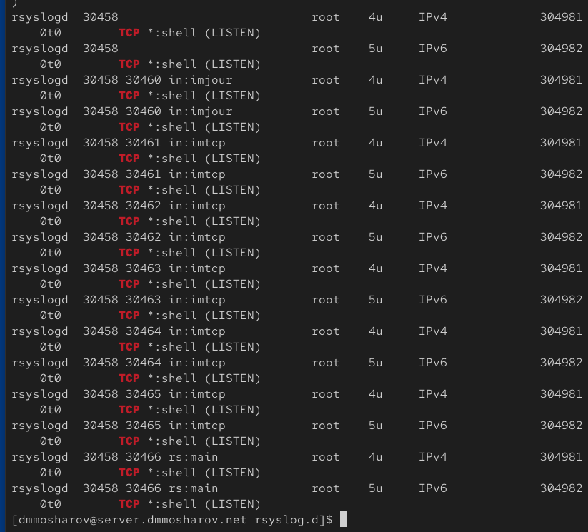
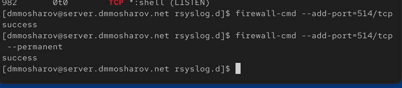
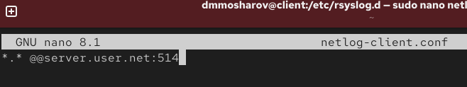
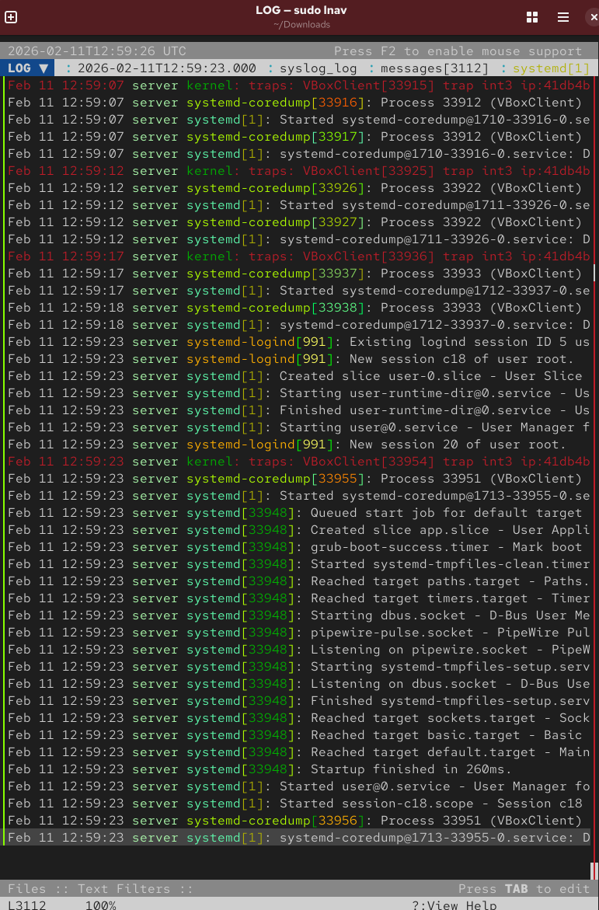
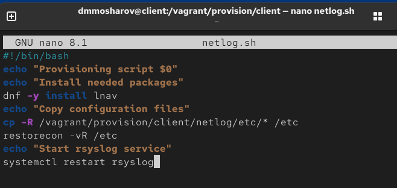

---
## Front matter
title: "Отчёт о лабораторной работе"
subtitle: "Лабораторная работа 15"
author: "Мошаров Денис Максимович"

## Generic otions
lang: ru-RU
toc-title: "Содержание"

## Bibliography
bibliography: bib/cite.bib
csl: pandoc/csl/gost-r-7-0-5-2008-numeric.csl

## Pdf output format
toc: true # Table of contents
toc-depth: 2
lof: true # List of figures
lot: true # List of tables
fontsize: 12pt
linestretch: 1.5
papersize: a4
documentclass: scrreprt
## I18n polyglossia
polyglossia-lang:
  name: russian4
  options:
	- spelling=modern
	- babelshorthands=true
polyglossia-otherlangs:
  name: english
## I18n babel
babel-lang: russian
babel-otherlangs: english
## Fonts
mainfont: IBM Plex Serif
romanfont: IBM Plex Serif
sansfont: IBM Plex Sans
monofont: IBM Plex Mono
mathfont: STIX Two Math
mainfontoptions: Ligatures=Common,Ligatures=TeX,Scale=0.94
romanfontoptions: Ligatures=Common,Ligatures=TeX,Scale=0.94
sansfontoptions: Ligatures=Common,Ligatures=TeX,Scale=MatchLowercase,Scale=0.94
monofontoptions: Scale=MatchLowercase,Scale=0.94,FakeStretch=0.9
mathfontoptions:
## Biblatex
biblatex: true
biblio-style: "gost-numeric"
biblatexoptions:
  - parentracker=true
  - backend=biber
  - hyperref=auto
  - language=auto
  - autolang=other*
  - citestyle=gost-numeric
## Pandoc-crossref LaTeX customization
figureTitle: "Рис."
tableTitle: "Таблица"
listingTitle: "Листинг"
lofTitle: "Список иллюстраций"
lotTitle: "Список таблиц"
lolTitle: "Листинги"
## Misc options
indent: true
header-includes:
  - \usepackage{indentfirst}
  - \usepackage{float} # keep figures where there are in the text
  - \floatplacement{figure}{H} # keep figures where there are in the text
---

# Цель работы

Получение навыков по работе с журналами системных событий

# Выполнение лабораторной работы

На сервере перейдем в каталог конфигурации rsyslog и создадим файл netlog-server.conf для настройки централизованного сбора логов (рис. [-@fig:001]).

{#fig:001}

В открывшемся редакторе внесем настройки для включения модуля imtcp и прослушивания порта 514 по протоколу TCP (рис. [-@fig:002]).

{#fig:002}

Перезапустим службу rsyslog для применения изменений и начнем проверку прослушиваемых портов с помощью утилиты lsof, отфильтровав вывод по TCP (рис. [-@fig:003]).

{#fig:003}

В продолжении вывода команды lsof убедимся, что процессы rsyslogd успешно прослушивают порт 514 на всех интерфейсах (рис. [-@fig:004]).

{#fig:004}

Настроим межсетевой экран на сервере, разрешив прием соединений по порту 514/tcp, и сохраним правило как постоянное (рис. [-@fig:005]).

{#fig:005}

Перейдем на клиентскую машину. В каталоге /etc/rsyslog.d создадим файл конфигурации netlog-client.conf (рис. [-@fig:006]).

{#fig:006}

В файле конфигурации пропишем правило отправки всех журналов (*.*) на сервер по адресу server.nsandryushin.net через порт 514 по протоколу TCP (рис. [-@fig:007]).

{#fig:007}

Вернемся на сервер и запустим отслеживание файла /var/log/messages в реальном времени, чтобы убедиться в поступлении логов (рис. [-@fig:008]).

{#fig:008}

Запустим графическую утилиту мониторинга системы. В открывшемся окне gnome-system-monitor просмотрим список активных процессов и потребляемые ими ресурсы (рис. [-@fig:009]).

{#fig:009}

Установим продвинутый просмотрщик логов lnav на сервере, скопировав исполняемый файл в системную директорию /usr/bin (рис. [-@fig:010]).

{#fig:010}

Запустим lnav на сервере и просмотрим журналы в удобном структурированном виде с подсветкой синтаксиса (рис. [-@fig:011]).

{#fig:011}

Приступим к автоматизации настроек. На сервере в каталоге /vagrant/provision создадим структуру папок для хранения конфигов и скопируем туда текущий файл настроек. Также создадим скрипт netlog.sh (рис. [-@fig:014]).

{#fig:014}

Напишем скрипт netlog.sh, который будет копировать конфигурационные файлы, восстанавливать контекст безопасности SELinux, настраивать фаервол и перезапускать службу rsyslog (рис. [-@fig:015]).

{#fig:015}

На клиенте выполним аналогичные действия: создадим структуру каталогов в /vagrant/provision, скопируем конфиг клиента и создадим установочный скрипт (рис. [-@fig:016]).

{#fig:016}

В скрипте netlog.sh для клиента пропишем установку пакета lnav, копирование конфигурации rsyslog, восстановление контекста SELinux и перезапуск службы (рис. [-@fig:017]).

{#fig:017}

Наконец, откроем Vagrantfile и добавим в конфигурации сервера и клиента блоки vm.provision типа shell, указывающие на созданные нами скрипты netlog.sh (рис. [-@fig:018]).

{#fig:018}

# Выводы

В результате выполнения лабораторной работы были получены навыки использования журналов системных событий