---
## Front matter
title: "Отчёт о лабораторной работе"
subtitle: "Лабораторная работа 16"
author: "Мошаров Денис Максимович"

## Generic otions
lang: ru-RU
toc-title: "Содержание"

## Bibliography
bibliography: bib/cite.bib
csl: pandoc/csl/gost-r-7-0-5-2008-numeric.csl

## Pdf output format
toc: true # Table of contents
toc-depth: 2
lof: true # List of figures
lot: true # List of tables
fontsize: 12pt
linestretch: 1.5
papersize: a4
documentclass: scrreprt
## I18n polyglossia
polyglossia-lang:
  name: russian
  options:
  - spelling=modern
  - babelshorthands=true
polyglossia-otherlangs:
  name: english
## I18n babel
babel-lang: russian
babel-otherlangs: english
## Fonts
mainfont: IBM Plex Serif
romanfont: IBM Plex Serif
sansfont: IBM Plex Sans
monofont: IBM Plex Mono
mathfont: STIX Two Math
mainfontoptions: Ligatures=Common,Ligatures=TeX,Scale=0.94
romanfontoptions: Ligatures=Common,Ligatures=TeX,Scale=0.94
sansfontoptions: Ligatures=Common,Ligatures=TeX,Scale=MatchLowercase,Scale=0.94
monofontoptions: Scale=MatchLowercase,Scale=0.94,FakeStretch=0.9
mathfontoptions:
## Biblatex
biblatex: true
biblio-style: "gost-numeric"
biblatexoptions:
  - parentracker=true
  - backend=biber
  - hyperref=auto
  - language=auto
  - autolang=other*
  - citestyle=gost-numeric
## Pandoc-crossref LaTeX customization
figureTitle: "Рис."
tableTitle: "Таблица"
listingTitle: "Листинг"
lofTitle: "Список иллюстраций"
lotTitle: "Список таблиц"
lolTitle: "Листинги"
## Misc options
indent: true
header-includes:
  - \usepackage{indentfirst}
  - \usepackage{float} # keep figures where there are in the text
  - \floatplacement{figure}{H} # keep figures where there are in the text
---

# Цель работы

Получить навыки работы с программным средством Fail2ban для обеспечения базовой защиты от атак типа "brute force".

# Выполнение лабораторной работы

Для начала на сервере устанавливаем fail2ban (рис. [-@fig:001]).

{#fig:001}

Запускаем сервер fail2ban (рис. [-@fig:002]).

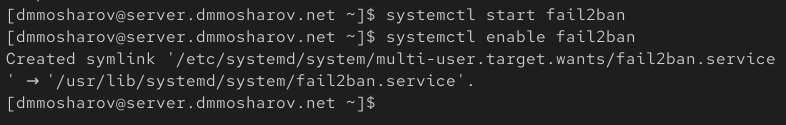{#fig:002}

В дополнительном терминале запускаем просмотр журнала событий fail2ban (рис. [-@fig:003]).

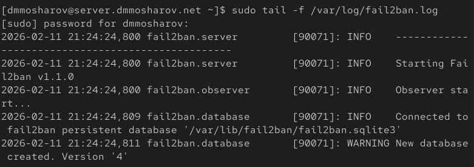{#fig:003}

Создаем файл с локальной конфигурацией fail2ban и открываем на редактирование /etc/fail2ban/jail.d/customisation.local (рис. [-@fig:004]).

{#fig:004}

В файле customisation.local содержатся параметры для блокирования на 1 час, также включили защиту SSH (рис. [-@fig:005]).

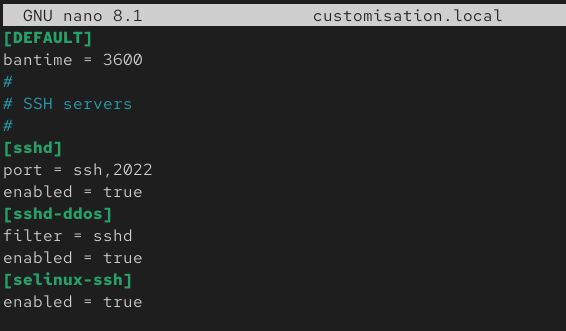{#fig:005}

Перезапускаем fail2ban (рис. [-@fig:006]).

{#fig:006}

Снова смотрим журнал событий (рис. [-@fig:007]).

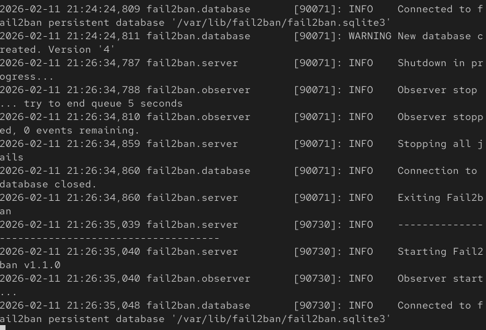{#fig:007}

Редактируем файл customisation.local и включаем защиту HTTP  (рис. [-@fig:008]).

{#fig:008}

Перезапускаем fail2ban и смотрим логи (рис. [-@fig:009]).

{#fig:009}

В файл customisation.local добавляем защиту почты (рис. [-@fig:010]).

{#fig:010}

Перезапустили fail2ban и смотрим логи (рис. [-@fig:011]).

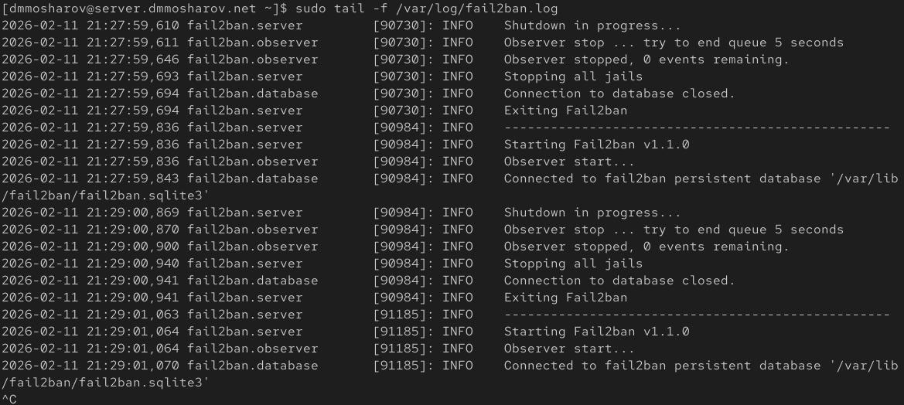{#fig:011}

Смотрим статус нашего fail2ban, далее смотрим статус защиты SSH и устаналиваем максимальное кол-во ошибок для SSH равное двум (рис. [-@fig:011.1]).

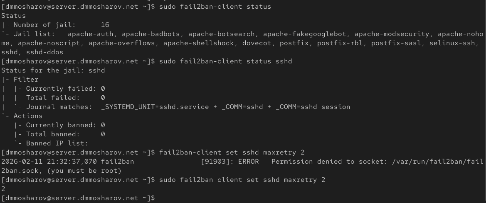{#fig:011.1}

С клиента пробуем зайти по SSH на сервер с неправильным паролем (рис. [-@fig:012]).

{#fig:012}

После этого на сервере смотрим статус защиты SSH и видим что произошла блокировка одного айпи адреса, 192.168.1.30 (рис. [-@fig:013]).

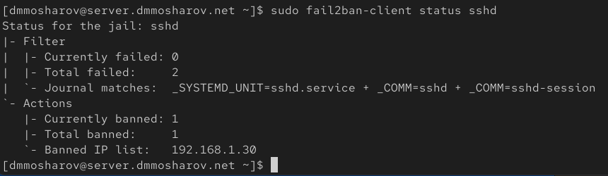{#fig:013}

Разблокируем данный IP-адрес клиента и убеждемся, что он был действительно разблокирован(рис. [-@fig:014]).

{#fig:014}

На сервере вносим изменение в конфигурационный файл, добавив в раздел по умолчанию игнорирование адреса нашего клиента (рис. [-@fig:015]).

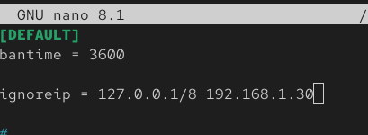{#fig:015}

Перезапускаем fail2ban (рис. [-@fig:016]).

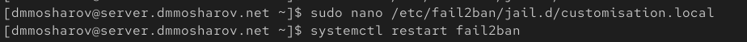{#fig:016}

Вновь пытаемся подключится используя неправильный пароль (рис. [-@fig:017]).

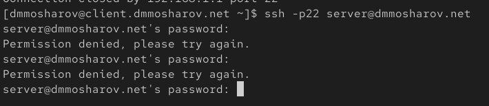{#fig:017}

Выведя статус защиты SSH убеждаемся, что бан был снят (рис. [-@fig:018]).

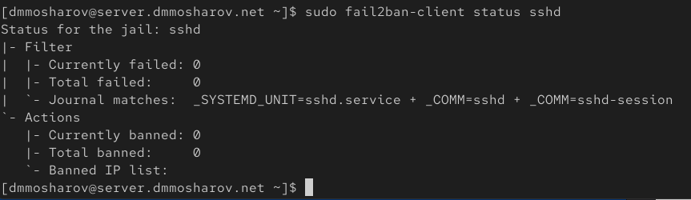{#fig:018}

На виртуальной машине server переходим в каталог для внесения изменений в настройки внутреннего окружения, создаем в нем каталог protect и помещаем туда все соответствующие подкаталоги и конфигурационные файлы, после чего открываем на редактирование наш protect.sh (рис. [-@fig:019]).

{#fig:019}

Прописываем следующий скрипт (рис. [-@fig:020]).

{#fig:020}

Для отработки созданного скрипта во время загрузки нашей виртуальной машины server в конфигурационный файл Vagrantfile добавляем нужные конфигурации (рис. [-@fig:021]).

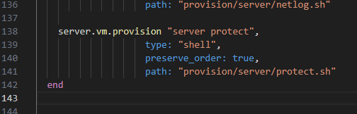{#fig:021}

# Выводы

В результате выполнения лабораторной работы были получены навыки работы с программным средством Fail2ban.